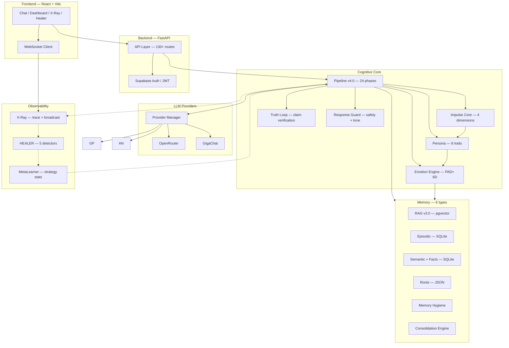
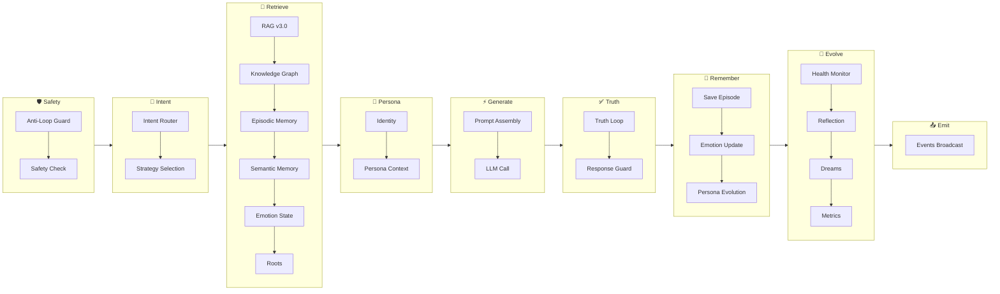
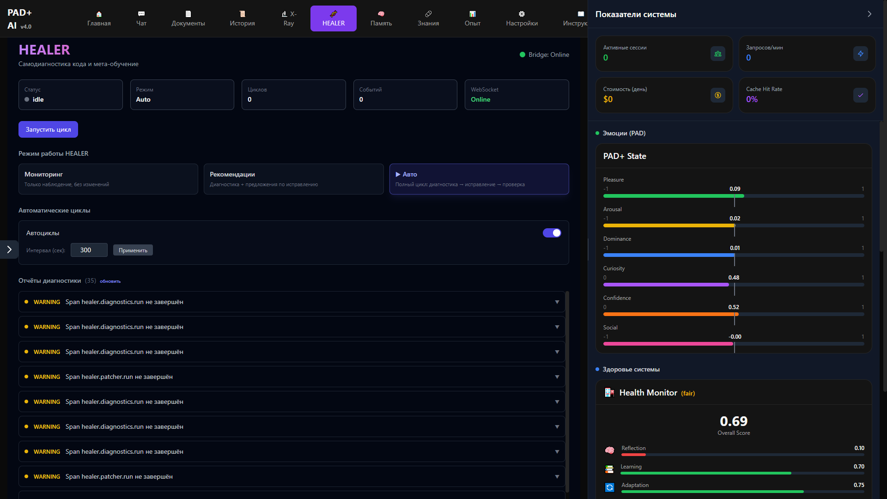
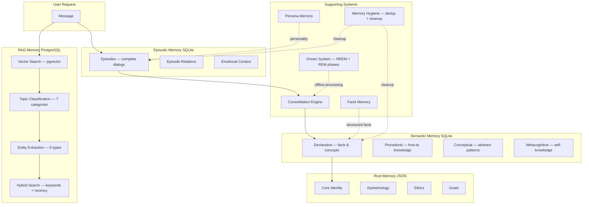

# PAD+ AI v4.0

<p align="center">
  <strong>Cognitive Architecture for Language Models</strong>
</p>

<p align="center">
  
  
  
  
  
  
  
  
</p>

PAD+ AI is a layer between the user and the language model that does not pass the request directly, but routes it through a sequence of cognitive phases: from determining the direction of thinking to verifying statements.

The system includes multi-layered memory (episodic, semantic, vector), an emotional model, personality evolution, and full tracing of every processing step. PAD+ AI does not replace LLMs and does not compete with them — it explores what the architecture around language models could look like.

---

## Table of Contents

- [Philosophy](#philosophy)
- [Cognitive Hierarchy](#cognitive-hierarchy)
- [Core Principles](#core-principles)
- [What Makes PAD+ AI Different](#what-makes-pad-ai-different)
- [System Architecture](#system-architecture)
- [Cognitive Pipeline](#cognitive-pipeline)
- [Core Components](#core-components)
  - [Impulse Core (Cognitive Predisposition Layer)](#impulse-core)
  - [X-Ray](#x-ray)
  - [HEALER](#healer)
  - [Memory](#memory)
  - [Emotion Engine](#emotion-engine)
  - [Truth Loop](#truth-loop)
  - [Provider Manager](#provider-manager)
  - [Persona](#persona)
  - [RAG v3.0](#rag)
- [Memory Architecture](#memory-architecture)
- [Technology Stack](#technology-stack)
- [Repository Structure](#repository-structure)
- [Screenshots](#screenshots)
- [Quick Start](#quick-start)
- [Deployment](#deployment)
- [Documentation](#documentation)
- [Roadmap](#roadmap)
- [Contributing](#contributing)
- [License](#license)

---

## Philosophy

Most AI applications follow one pattern: request → LLM → response. All logic lives in a single prompt. The system is stateless, has no memory of the past, and never questions its own answers.

PAD+ AI is built on a different idea.

Before sending a request to the language model, the system passes through a sequence of cognitive layers, each of which modifies state that influences generation. The LLM receives not a raw request, but a context already shaped by personality, emotions, memory, and cognitive direction.

The project explores the question: **what should happen between receiving a request and generating a response, beyond a single model call?**

This is not a chatbot, not an agent, and not an API wrapper. It is a research implementation of a cognitive architecture in which every component is isolated, traceable, and independently replaceable.

> PAD+ AI is not designed to imitate consciousness.  
> It is designed to preserve causal continuity of cognition across multiple reasoning layers.

---

## Cognitive Hierarchy

The decision-making process in PAD+ AI follows a vertical hierarchy. Each level answers its own question and passes the result to the next:

```
                    IMPULSE CORE
            (cognitive predisposition)
                        │
              "What matters right now?"
                        │
                        ▼

                     PERSONA
                  (identity)
                        │
               "Who is making the decision?"
                        │
                        ▼

                  EMOTIONS
              (affective state)
                        │
            "What state is the system in?"
                        │
                        ▼

                   MEMORY
               (knowledge retrieval)
                        │
          "What does the system recall right now?"
                        │
                        ▼

                 GENERATION
              (LLM + context)
                        │
              "How to respond to this?"
                        │
                        ▼

                 TRUTH LOOP
               (verification)
                        │
               "Is this true?"
                        │
                        ▼

                EVOLUTION
             (state updates)
                        │
           "What changed after the response?"
                        │
                        ▼

                  RESPONSE
```

This hierarchy is not an abstraction. Each level is implemented as an isolated module with its own data, API, and tests.

---

## Core Principles

<dl>
<dt><strong>Observability</strong></dt>
<dd>Every processing step is traced in real time. X-Ray captures all 24 pipeline phases, strategy decisions, emotion changes, and verification results. The system has no "dark" segments.</dd>

<dt><strong>Cognitive Predisposition</strong></dt>
<dd>Before generating a response, the system determines the direction of thinking through Impulse Core — four orthogonal dimensions that shift the prior probabilities of the response without direct instructions.</dd>

<dt><strong>Memory as Ecosystem</strong></dt>
<dd>Memory is not a single store but a hierarchy of layers: from raw dialogues (RAG) through episodes to semantic concepts and immutable principles. Knowledge is consolidated between layers automatically.</dd>

<dt><strong>Identity</strong></dt>
<dd>The system has a stable personality (persona) with traits, values, and communication style. The personality evolves based on interactions but preserves its core.</dd>

<dt><strong>Emotions</strong></dt>
<dd>The six-dimensional PAD+ model (Pleasure, Arousal, Dominance, Curiosity, Confidence, Social Connection) influences tone, verbosity, and response style. Emotions decay over time and react to events.</dd>

<dt><strong>Truth Verification</strong></dt>
<dd>Every statement in a response passes through the Truth Loop — a check for contradictions with internal memory and an assessment of credibility. The system can signal uncertainty in its response.</dd>

<dt><strong>Modularity</strong></dt>
<dd>The pipeline consists of 24 independent phases. Each phase is a class with a single interface. Phases can be replaced, reordered, or disabled without modifying neighboring components.</dd>

<dt><strong>Reflection</strong></dt>
<dd>After each response, the system analyzes the result: compares expected and actual confidence, extracts lessons, updates MetaLearner. A separate Dream System processes memory in the background.</dd>

<dt><strong>Explainability</strong></dt>
<dd>X-Ray records not just metrics but the system's "thoughts" at each stage: why this strategy was chosen, which memories were retrieved, which statements were verified. This makes system behavior interpretable.</dd>
</dl>

---

## What Makes PAD+ AI Different

| | Conventional AI | PAD+ AI |
|---|---|---|
| **Response** | Responds to a prompt | Thinks through cognitive layers |
| **Context** | Retrieves from history | Preserves causal continuity across memory layers |
| **Interface** | Relies on prompt engineering | Uses a structured cognitive pipeline |
| **State** | Stateless per request | Maintains persistent emotional, personal and episodic state |

---

## System Architecture



---

## Cognitive Pipeline

Every request passes through a sequence of phases. Phases are grouped by functional stage:



The pipeline includes 24 phases grouped into 8 stages: Safety → Intent → Retrieve → Persona → Generate → Truth → Remember → Evolve → Emit.

---

## Core Components

### Impulse Core

Impulse Core is the top level of the cognitive architecture. It determines the **direction of thinking** before personality, emotions, and memory are engaged.

Unlike emotions (which describe current state) or persona (which describes stable identity), Impulse sets **cognitive predisposition**: the direction in which the system will process the request.

Impulse is not an instruction. The model is not required to follow it — it merely shifts the prior probabilities of the response.

**Four dimensions:**

| Dimension | Meaning | Influence |
|---|---|---|
| **Understand** | Desire to comprehend | Deep analysis, knowledge retrieval, interpretation |
| **Improve** | Desire to enhance | Planning, refactoring, self-correction |
| **Protect** | Preserving integrity | Safety, verification, stability |
| **Create** | Exploration and novelty | Creativity, synthesis, new ideas |

Impulse is stored as a vector of 4 weights (not normalized to 1.0), supports a state stack (push/pop), and is restored on restart.

**Integration:** Impulse is embedded into the system prompt of the Generate Phase as `impulse_line`. Components lower in the hierarchy (Persona, Emotion, Memory) do not depend on Impulse directly — they are processed in parallel, and their results are merged at the prompt assembly stage.

---

### X-Ray

X-Ray is a full observability system embedded in every request. Not logs and not metrics, but a **structured trace with the system's "thoughts"**.

**How it works:**

1. TraceCollector creates a session for each request
2. Each pipeline phase records an event: name, duration, status, data
3. ThoughtVisualizer generates human-readable "thoughts" for key phases
4. Broadcaster sends events via WebSocket in real time
5. After completion — the session is closed and becomes available for analysis

**What is logged:**

- Strategy selection and reason
- Each of the 24 pipeline phases with duration
- Emotion changes
- Truth Loop verification results
- Errors and degradations
- Model and provider used

**What the user sees:**


Right panel with tabs:
- **Trace** — current request by stage with durations
- **Thought Stream** — system "thoughts" at each step
- **History** — recent requests
- **Stats** — latency, errors, models

---

### HEALER

HEALER is a self-diagnostics and self-recovery subsystem. It works as a subscription to TraceCollector events: after each session ends, it runs detectors and applies remediation if needed.

**Five detectors:**

| Detector | What it checks | Action |
|---|---|---|
| SlowPhasesDetector | Pipeline phases executing beyond threshold | Switch to a faster model |
| ErrorPathDetector | Errors without fallback | Enable safe-mode |
| BrokenPhasesDetector | Missing required phases | Restart the failing phase |
| ProviderHealthDetector | LLM provider stability | Downgrade priority / remove from rotation |
| StrategyDriftDetector | Strategy degradation over time and confidence | Switch strategy |

**Operating modes:**
- `monitor` — logging only
- `suggest` — recommendations (no automatic changes)
- `auto` — automatic remediation

HEALER is implemented as a standalone module (121 tests, zero external dependencies) and integrated via `backend/healing/`.



---

### Memory

PAD+ AI uses six types of memory, separated by purpose and lifetime:

| Type | Storage | Lifetime | Purpose |
|---|---|---|---|
| **RAG v3.0** | PostgreSQL / pgvector | Long | Vector search over dialogues |
| **Episodic** | SQLite | Medium | Full episodes with emotional context |
| **Semantic** (including Facts) | SQLite | Long | Concepts, procedural knowledge, structured facts |
| **Roots** | JSON | Infinite | Fundamental principles (immutable) |
| **Persona** | SQLite | Long | Personality traits, values, style |
| **Hygiene** | — | Background | Deduplication, cleanup of stale records |

Memory supports consolidation: episodes → semantic concepts → principles. Runs automatically every N dialogues.

---

### Emotion Engine

Six-dimensional emotional model PAD+ (Pleasure, Arousal, Dominance, Curiosity, Confidence, Social Connection).

**How it works:**

1. Each interaction triggers an event (user_praise, contradiction, new_knowledge, etc.)
2. The event modifies emotion parameters according to the effects table
3. Emotions decay over time (0.001/sec) toward neutral values
4. Based on current state, response style is computed: tone (friendly/neutral/serious), verbosity (concise/moderate/detailed), color (confident/balanced/uncertain)
5. Style is embedded in the Generate Phase prompt

Emotions do not simulate feelings — they form an affective layer that influences **how** the system responds, not **what** it says.

---

### Truth Loop

Truth Loop extracts statements from the LLM-generated response and checks each one for contradictions against internal memory (facts, semantic memory, Roots).

**Process:**

1. Split the response into individual claims
2. Search memory for confirmations or contradictions for each claim
3. Assess overall confidence in the response
4. If confidence falls below threshold — add a disclaimer

Truth Loop does not block responses, but informs the user about the degree of reliability.

---

### Provider Manager

ProviderManager is a unified interface to all LLM providers with automatic fallback.

**Supported providers:**

| Provider | Authentication | Free Access |
|---|---|---|
| OpenRouter | API Key | Partially (depends on model) |
| GigaChat | OAuth (system key) | ✅ |

**Fallback logic:** If the first provider is unavailable (401, 429, 5xx, timeout), the system tries the next in the chain. For OpenRouter, fallback is GigaChat, and vice versa.

**User keys:** Each user adds their own API keys via settings (⚡ in header). The system uses **user's own keys** for generating responses and embeddings — each user pays for their own usage. System keys are only used as fallback for users without keys.

---

### Knowledge Graph

Knowledge Graph is the system's knowledge graph storing concepts and relationships. Used for:

- **Graph RAG** — graph context injected into LLM prompt on every response (Phase 1)
- **Auto-extraction** — every user message enriches graph with concepts (Phase 2)
- **Sync** — bidirectional sync SQLite (local) ↔ Supabase (production) (Phase 3)
- **Semantic Search** — vector embeddings (OpenRouter text-embedding-3-small, 384 dim) + cosine similarity (Phase 4)
- **UI Editor** — add/delete/merge concepts, edit relations (Phase 5)

**User embeddings:** Embedding generation (POST `/recompute-embeddings`) uses **user's own OpenRouter key** from their saved providers. Each user pays for their own tokens. If no key — returns error suggesting to add key in settings (⚡).

**API endpoints:**
- `GET /api/v1/knowledge/search?q=...` — search by name
- `GET /api/v1/knowledge/semantic-search?q=...` — semantic search (cosine similarity)
- `POST /api/v1/knowledge/recompute-embeddings?limit=50` — regenerate embeddings (uses user's key)
- `POST /api/v1/knowledge/concepts/{id}/merge` — merge two concepts
- `DELETE /api/v1/knowledge/concepts/{id}` — delete concept
- `PATCH /api/v1/knowledge/relations` — create/update relation

---

## Memory Architecture



The Consolidation Engine moves knowledge upward: episodes are distilled into semantic concepts, concepts are generalized into principles in Roots. The Dream System processes memory in the background, building unexpected connections between disparate episodes.

---

## Technology Stack

| Component | Technology |
|---|---|
| **Backend** | Python 3.11+, FastAPI, Uvicorn, Pydantic v2 |
| **Frontend** | React 18, Vite 5, Tailwind CSS 3, Recharts, D3 |
| **Database** | PostgreSQL 15 (Supabase) + SQLite |
| **Vector Search** | pgvector (PostgreSQL extension) |
| **Auth** | Supabase Auth (JWT) |
| **Cache** | Redis 7 (optional) |
| **LLM Providers** | OpenRouter, GigaChat |
| **LLM Interface** | ProviderManager (unified SDK interface) |
| **Pipeline** | PipelineExecutor v4.0, 24 stages |
| **X-Ray** | TraceCollector + WebSocket Broadcaster + ThoughtVisualizer |
| **HEALER** | Self-contained module, zero external dependencies |
| **CI** | GitHub Actions (pytest, ruff, black, mypy) |
| **Deployment** | Render (Web Service + Static Site), Docker |
| **Testing** | pytest, 400+ test functions |

---

## Repository Structure

```
PAD+ AI/
├── backend/                    # FastAPI backend
│   ├── api/                    # 130+ routes
│   ├── core/                   # System core
│   │   ├── pipeline/           # Pipeline v4.0 (executor + phases)
│   │   ├── xray/               # X-Ray (trace, broadcast, visualization)
│   │   └── guard/              # Response Guard (safety, tone, cognition)
│   ├── emotion/                # PAD+ emotional model
│   ├── memory/                 # 6 memory types + consolidation + hygiene
│   ├── runtime/                # ProviderManager + LLMService
│   ├── healing/                # HEALER integration (detectors + remediation)
│   ├── autonomy/               # Autonomous processes (planner, scheduler)
│   └── knowledge/              # Knowledge Graph
├── frontend/                   # React + Vite frontend
│   └── src/
│       ├── pages/              # 12 pages (Chat, X-Ray, Healer, Memory, etc.)
│       ├── components/         # UI components
│       └── services/           # API clients
├── HEALER/                     # Self-contained HEALER module
│   ├── healer/                 # Diagnostics, patcher, verifier, orchestrator
│   └── aethon/xray/            # X-RAY kernel (17 modules)
├── docs/                       # Documentation
│   ├── architecture/           # Architecture documents (5 files)
│   └── impulse/                # Impulse Core documentation
├── tests/                      # 400+ test functions
│   ├── test_pipeline/          # Pipeline tests
│   ├── test_xray/              # X-Ray tests
│   └── hardening/              # Hardening tests
└── scripts/                    # Utility scripts
```

---

## Screenshots

| Screen | Description |
|---|---|
| `screenshots/dashboard.png` | Main dashboard — system metrics, emotions, memory state |
| `screenshots/chat.png` | Chat interface with X-Ray panel on the right |
| `screenshots/xray.png` | X-Ray trace — system thoughts, stages, errors |
| `screenshots/healer.png` | HEALER dashboard — detectors, reports, remediation |
| `screenshots/memory.png` | Memory dashboard — statistics across all memory types |
| `screenshots/documents.png` | Document and collection management |
| `screenshots/providers.png` | LLM provider configuration |
| `screenshots/history.png` | Dialogue history with filtering |
| `screenshots/settings.png` | User settings |
| `screenshots/experience.png` | Experience and Impulse Core |
| `screenshots/knowledge.png` | Knowledge graph |
| `screenshots/instructions.png` | System instructions |

---

## Quick Start

```bash
# Clone
git clone <repository-url>
cd PAD-AI

# Backend
pip install -r requirements.txt
cp .env.example .env   # fill in SUPABASE_*, ENCRYPTION_*, providers
uvicorn backend.main:app --reload --port 8080

# Frontend (new terminal)
cd frontend
npm install
npm run dev
```

Open `http://localhost:5174`.

**Requirements:** Python 3.11+, Node.js 18+, PostgreSQL 15+, Redis 7+ (optional).

---

## Deployment

### Render (cloud)

Deploy button:

[](https://render.com/deploy)

**Backend:** Web Service — `render.yaml`  
**Frontend:** Static Site — build `frontend/`, publish `frontend/dist`

### Environment Variables

| Variable | Description |
|---|---|
| `SUPABASE_URL` | Supabase project URL |
| `SUPABASE_KEY` | Public anon key |
| `SUPABASE_SERVICE_KEY` | Service role key (backend only) |
| `ENCRYPTION_KEY` | Encryption key (base64, 32 bytes) |
| `ENCRYPTION_SALT` | Encryption salt (base64, 32 bytes) |
| `CSRF_SECRET_KEY` | CSRF secret |
| `FRONTEND_URL` | Frontend URL for CORS |
| `DATABASE_URL` | PostgreSQL connection string |
| `REDIS_URL` | Redis connection string (optional) |

### Docker

```bash
docker build -t padplus-backend .
docker run -d --name padplus -p 8080:8080 --env-file .env padplus-backend
```

---

## Documentation

| Document | Description |
|---|---|
| [ARCHITECTURE.md](docs/ARCHITECTURE.md) | System architecture, pipeline, memory, emotions |
| [API.md](docs/API.md) | Full API specification (28 sections) |
| [RELEASE_v4.0.md](docs/RELEASE_v4.0.md) | Release manifest, known limitations, checklists |
| [XRAY.md](docs/XRAY.md) | X-Ray observability system |
| [XRAY_GUIDE.md](docs/XRAY_GUIDE.md) | X-Ray testing guide |
| [DEPLOYMENT.md](docs/DEPLOYMENT.md) | Production deployment |
| [RLS_POLICIES.md](docs/RLS_POLICIES.md) | Row Level Security policies |
| [PROJECT_STRUCTURE.md](docs/PROJECT_STRUCTURE.md) | Full project structure |
| [SELF_HEALING_ARCHITECTURE.md](docs/SELF_HEALING_ARCHITECTURE.md) | HEALER architecture |
| [IMPULSE_CORE.md](docs/impulse/IMPULSE_CORE.md) | Impulse Core concept |
| [IMPULSE_ARCHITECTURE.md](docs/impulse/IMPULSE_ARCHITECTURE.md) | Impulse integration into the system |

Subsystem documentation: [docs/architecture/](docs/architecture/) — Overview, Pipeline, Memory System, Emotion System, Meta System.

---

## Roadmap

```
✓ v1 — Episodic + Semantic Memory
✓ v2 — RAG + Vector Search
✓ v3 — Personality + Emotion Engine
✓ v4 — Cognitive Pipeline (current)

---
▲ v4.1 — Security audit, HEALER isolation, CORS hardening
△ v4.2 — Multi-worker, async consolidation, structured logging
○     — Cognitive Observatory, Self Evolution, Multi-Agent
```

---

## Contributing

Pull Requests are welcome. Key rules:

1. **Before making changes** — open an Issue describing the proposed change
2. **Code** — must conform to PEP 8, be typed, and covered by tests
3. **Tests** — `pytest tests/` must pass fully
4. **X-Ray tests** — for pipeline changes, tests via TraceCollector are required (see [XRAY_GUIDE.md](docs/XRAY_GUIDE.md))
5. **Documentation** — API changes must be reflected in [API.md](docs/API.md)

**Reporting a bug:** open an Issue with the `bug` label, attach a trace from X-Ray and logs.

---

## License

Apache License 2.0. See [LICENSE](LICENSE).

---

PAD+ AI explores the question: **what happens between receiving a request and producing a response?**

This project does not attempt to replace language models and does not compete with them. It explores what the cognitive architecture around them could look like — what layers are necessary, how they interact, and how to make system behavior transparent and interpretable.

The system does not claim to possess consciousness, feelings, or understanding. Impulse, emotions, personality, and memory are engineering constructs created to explore cognitive architectures on top of modern language models.