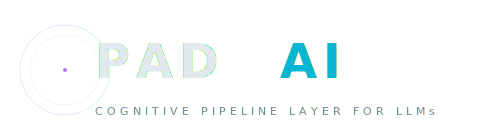
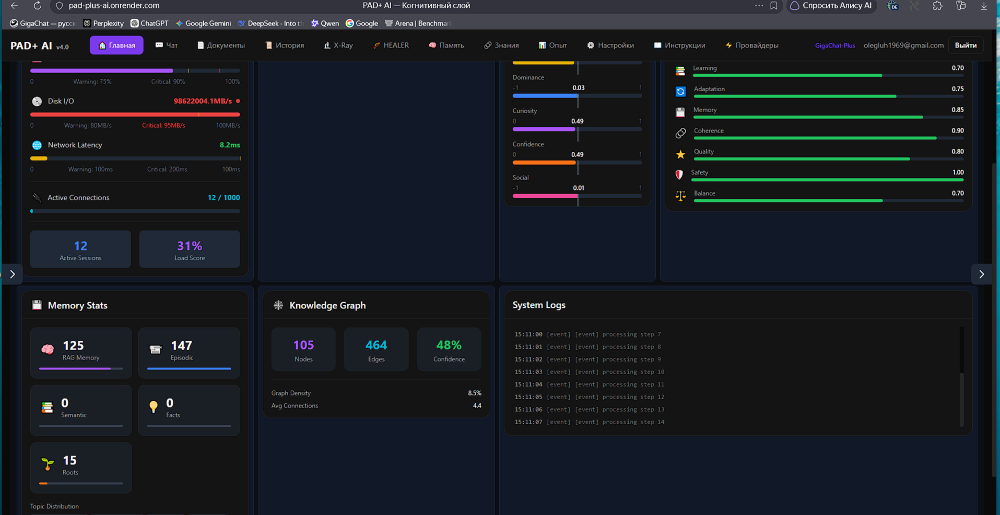
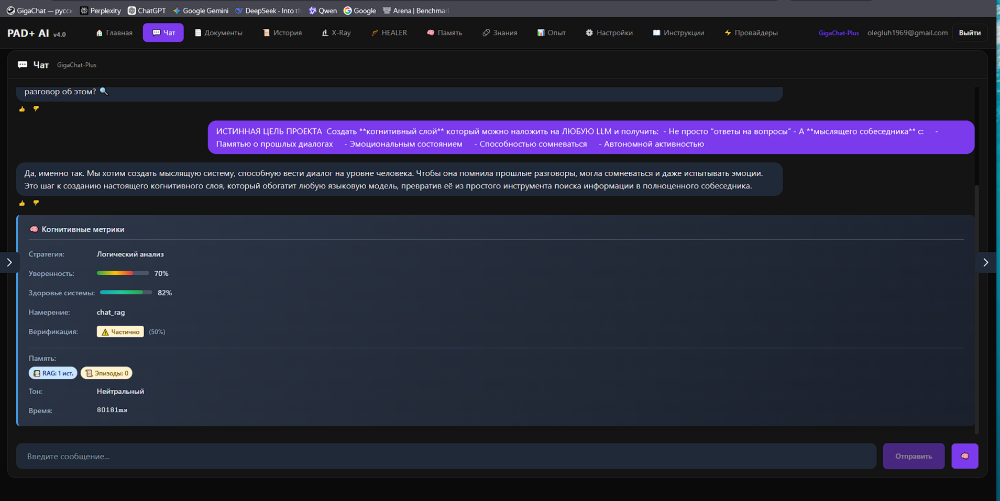
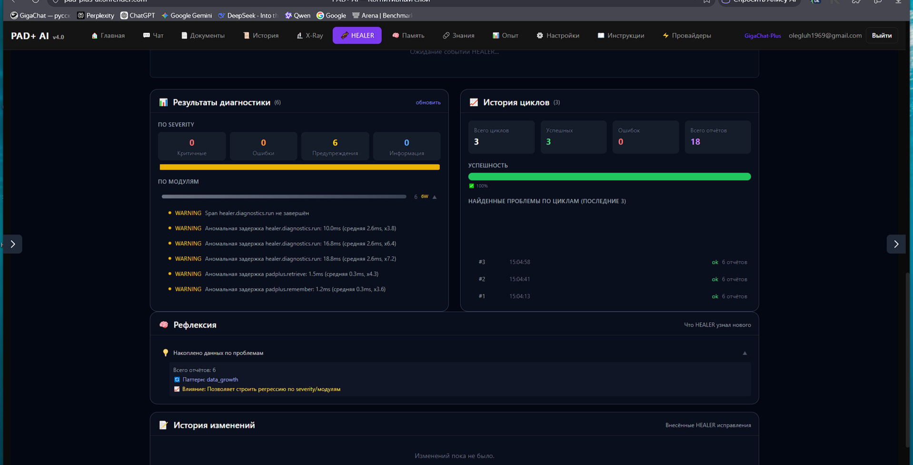
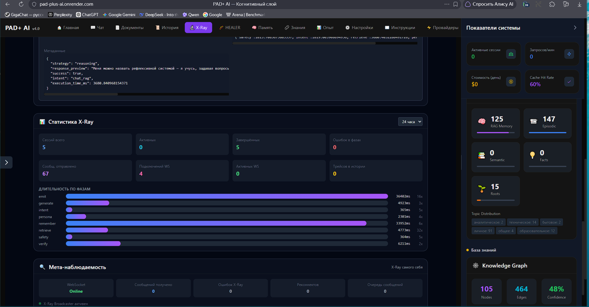

<p align="center">
  <picture>
    <source media="(prefers-color-scheme: dark)" srcset="assets/logo.svg">
    
  </picture>
</p>

<p align="center">
  <strong>Когнитивный пайплайн-слой для LLM</strong>
  <br>
  <em>PAD+ AI добавляет эмоции, память, автономность и мета-когницию любому LLM</em>
</p>

<p align="center">
  <a href="https://pad-plus-ai.onrender.com">
    
  </a>
  <a href="https://pypi.org/project/pad-plus-ai/">
    
  </a>
  <a href="https://github.com/Ovladimirovich/pad-plus-ai/actions">
    
  </a>
  <a href="https://pypi.org/project/pad-plus-ai/">
    
  </a>
  <a href="https://github.com/Ovladimirovich/pad-plus-ai/blob/main/LICENSE">
    
  </a>
  <a href="https://github.com/Ovladimirovich/pad-plus-ai/issues">
    
  </a>
  <a href="https://github.com/Ovladimirovich/pad-plus-ai/blob/main/CONTRIBUTING.md">
    
  </a>
</p>

---

## Что такое PAD+ AI?

PAD+ AI — это **открытая когнитивная архитектура**, которая размещается поверх любого LLM, превращая его в самоосознанную, эмоционально-обоснованную систему с богатой памятью.

**PAD+ = Pleasure, Arousal, Dominance + Curiosity, Confidence, Social Connection**

Обычные LLM: запрос → ответ. PAD+ AI добавляет:

- **Эмоции** — 6-мерная модель PAD+ с затуханием, влиянием на стиль ответов
- **Память** — 6 типов (RAG, эпизодическая, семантическая, факты, корни, личность)
- **Автономность** — планирование, иерархические цели, сновидения, рефлексия
- **Мета-когниция** — маршрутизация намерений, верификация истины, мониторинг здоровья
- **Безопасность** — защита от инъекций, анти-зацикливание, rate limiting

Всё работает через 9-стадийный конвейер обработки.

> **Live demo:** https://pad-plus-ai.onrender.com

---

## Скриншоты

| Control Center | Чат |
|---|---|
|  |  |

| X-Ray наблюдаемость | Healer диагностика |
|---|---|
|  |  |

---

## Быстрый старт

### Требования

- Python 3.10+
- Node.js 18+
- OpenRouter API ключ (для доступа к LLM)

### Установка

```bash
# Backend
pip install pad-plus-ai
# или из исходников:
pip install -r requirements.txt

# Frontend
cd frontend && npm install && cd ..
```

### Конфигурация

```bash
cp .env.example .env
# Отредактируйте .env → добавьте OPENROUTER_API_KEY
```

### Запуск

```bash
# Windows
.\start.bat

# Вручную — Terminal 1 (Backend)
cd backend && uvicorn main:app --reload --port 8080

# Вручную — Terminal 2 (Frontend)
cd frontend && npm run dev
```

Откройте **http://localhost:5174**

---

## Основные возможности

### 🧠 Система памяти

| Тип | Описание |
|------|-------------|
| **RAG Memory v3.0** | Семантический поиск через ChromaDB, классификация тем, извлечение сущностей |
| **Episodic Memory** | Хранение эпизодов с временными метками |
| **Semantic Memory** | Общие знания и концепции |
| **Fact Memory** | Структурированные факты (субъект-предикат-объект) |
| **Roots Memory** | Фундаментальные принципы — философия, этика, идентичность |
| **Persona** | Развивающаяся личность с чертами характера |
| **Consolidation** | Консолидация памяти по аналогии со сном |
| **Hygiene** | Автоочистка: дедупликация, обрезка, удаление orphan |

### 😊 PAD+ Модель эмоций

Шестимерное эмоциональное состояние, меняющееся с каждым взаимодействием:

- **P**leasure — удовлетворение результатами
- **A**rousal — вовлечённость и бдительность
- **D**ominance — чувство контроля
- **C**uriosity — стремление исследовать
- **C**onfidence — уверенность в себе
- **S**ocial Connection — качество отношений

Эмоции естественно затухают со временем и влияют на стиль, тон и содержание ответов.

### 🔄 Система автономности

- **Планировщик** — формулирует вопросы и задачи
- **Иерархический планировщик** — многоуровневые цели
- **Сновидения** — обработка памяти в периоды покоя
- **Авто-рефлексия** — каждые N диалогов
- **Оценщик качества** — самооценка ответов
- **Авто-обновление знаний** — наполнение графа знаний

### 🛡️ Безопасность

- **Защита от инъекций** — защита от prompt injection
- **Анти-зацикливание** — предотвращение бесконечных циклов
- **Rate Limiter** — ограничение запросов
- **Truth Loop** — проверка фактов

### 🧩 Мета-когниция

- **Meta Controller** — выбор стратегий обработки
- **Intent Router** — классификация намерений
- **Truth Loop** — итеративная верификация
- **Health Monitor** — оценка когнитивного здоровья
- **Cognitive Load** — оценка загрузки

---

## Архитектура

### 9-стадийный пайплайн

```
User Message → Safety → Intent → Retrieve → Persona → Generate → Truth → Remember → Emit
```

### Структура проекта

```
pad-plus-ai/
├── backend/
│   ├── core/               # Пайплайн, safety, intent, meta
│   ├── memory/             # RAG v3.0, episodic, semantic, persona
│   ├── emotion/            # PAD+ модель эмоций
│   ├── llm/                # LiteLLM интеграция
│   ├── knowledge/          # Граф знаний (NetworkX)
│   ├── autonomy/           # Планировщик
│   ├── analytics/          # Метрики и аналитика
│   ├── api/                # FastAPI роуты (145+ эндпоинтов)
│   └── main.py             # Entry point
├── frontend/               # React 18 + Vite + TypeScript
├── docs/                   # 18 файлов документации
├── tests/                  # Unit + integration тесты
└── scripts/                # Утилиты
```

---

## Обзор API

145+ эндпоинтов в 11 категориях. Полная документация: `/docs` при запуске (Swagger UI) или [docs/API.md](docs/API.md).

| Категория | Ключевые эндпоинты |
|-----------|-------------------|
| **Auth** | `POST /api/v1/auth/register`, `/login`, `/profile` |
| **Chat** | `POST /api/v1/chat`, `/chat/stream` (SSE) |
| **Состояние** | `GET /api/v1/mind-state` |
| **Память** | `GET /api/v1/rag/stats`, `/rag/search` |
| **Факты** | `GET /api/v1/facts/stats`, `/facts/contradictions` |
| **Эмоции** | `GET /api/v1/emotion/state` |
| **Persona** | `GET /api/v1/persona/stats`, `/persona/traits` |
| **Корни** | `GET /api/v1/roots/philosophy`, `/roots/ethics` |
| **Автономия** | `GET /api/v1/autonomy/status` |
| **Аналитика** | `GET /api/v1/analytics/dashboard` |
| **Здоровье** | `GET /api/v1/health`, `/health/report` |
| **WebSocket** | `WS /ws` — real-time |

---

## Сравнение: PAD+ AI vs Альтернативы

| Возможность | PAD+ AI | LangChain | AutoGen | CrewAI |
|------------|---------|-----------|---------|--------|
| **Эмоции** | ✅ PAD+ (6 измерений) | ❌ | ❌ | ❌ |
| **Типы памяти** | 6 типов | 3 типа | 1 тип | 1 тип |
| **Автономность** | ✅ Планировщик + иерархический + сновидения | ❌ | ✅ Частично | ✅ Ролевая |
| **Safety-слой** | ✅ Инъекции + анти-луп + верификация | ❌ | ❌ | ❌ |
| **Мета-когниция** | ✅ Meta controller + health monitor | ❌ | ❌ | ❌ |
| **Граф знаний** | ✅ NetworkX с автозаполнением | ❌ | ❌ | ❌ |
| **Фронтенд** | ✅ React 18 + Vite + TypeScript | ❌ | ❌ | ❌ |
| **API эндпоинты** | 145+ | Ограничено | Ограничено | Ограничено |

---

## Тестирование

```bash
# Все тесты
pytest tests/

# Unit / Integration
pytest tests/unit/
pytest tests/integration/

# По компонентам
pytest -m rag -m autonomy -m emotion -m pipeline

# Frontend
cd frontend && npm test && cd ..
```

---

## Философское ядро

> *«Не закрепляй знания, сомневайся, проверяй. Каждое утверждение — гипотеза.»*

**ANTI_DIRECTIVE** — философский фундамент PAD+ AI, встроенный скептицизм, не позволяющий системе принимать знания как абсолютную истину.

---

## Лицензия

[Apache License 2.0](LICENSE) © 2026 PAD+ AI Contributors

---

<p align="center">
  <sub>PAD+ AI — Когнитивный пайплайн-слой для LLM</sub>
  <br>
  <a href="https://pad-plus-ai.onrender.com">Live Demo</a> •
  <a href="https://github.com/Ovladimirovich/pad-plus-ai">GitHub</a> •
  <a href="https://pypi.org/project/pad-plus-ai/">PyPI</a>
</p>
