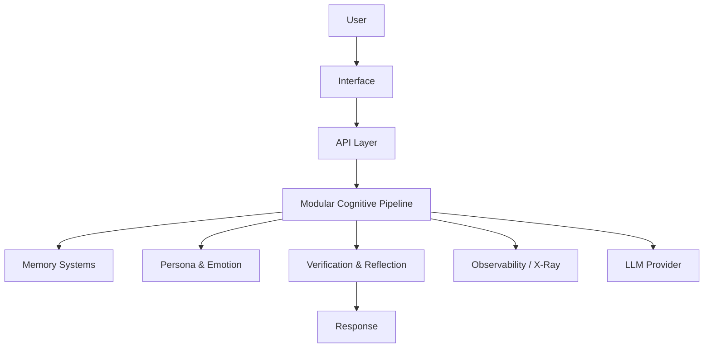
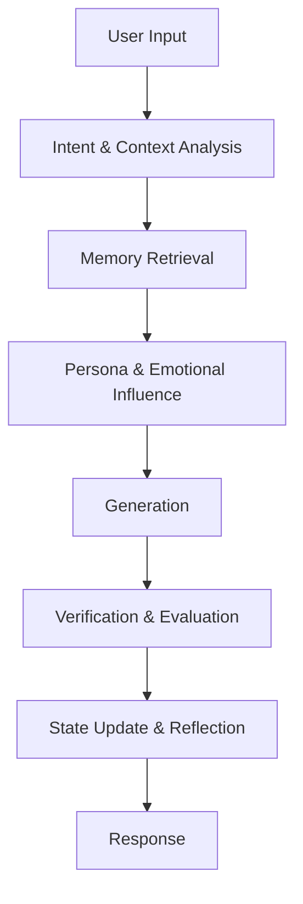

# Modern AI Does Not Need Another Chatbot. It Needs a Better Architecture



Most AI applications still look surprisingly similar.

User
↓
Prompt
↓
LLM
↓
Response

That shape is simple, and that simplicity is part of the problem. It makes building a product feel easy. It also makes the system feel shallow. In many cases, the intelligence of the application is reduced to a single call to a language model, with the rest of the runtime delegated to prompt engineering, a few retrieval steps, and some post-processing.

That is not a criticism of language models. It is an observation about architecture.

Modern LLMs are powerful, but they are not substitutes for structure. They are not a complete cognitive system by themselves. Once an application grows beyond a trivial demo, the real question is no longer “how do we make the model answer better?” It becomes “what happens between the user’s request and the final response?”

That question is where PAD+ AI begins.

PAD+ AI is not another LLM. It is not another wrapper around an API. It is not a chatbot with a nicer shell. It is an open research platform for exploring cognitive architectures around existing language models. The goal is not to replace the model. The goal is to build a system that can reason, remember, verify, adapt, and explain its behavior in ways that a single prompt-driven interaction cannot.

That is a more interesting problem than most product teams admit.

> Live demo: https://pad-plus-ai.onrender.com  
> GitHub repository: https://github.com/Ovladimirovich/pad-plus-ai

## The Architectural Problem

The mainstream approach to AI applications has converged on a very narrow mental model: the model is the brain, and everything else is scaffolding. The result is that many systems are optimized for fluency rather than continuity.

A user asks a question, the system sends it to a model, and the model returns an answer. That is convenient, but it leaves several important concerns unresolved.

First, there is no durable sense of state. The system may remember a few recent turns, but it often lacks a deeper notion of identity, intention, emotional context, or long-term trajectory. Second, the system has very little internal discipline. There is no explicit verification loop. Third, the architecture usually lacks observability. If something goes wrong, it is hard to explain why. Fourth, the system cannot easily evolve. It is difficult to test alternative reasoning strategies, compare memory mechanisms, or reason about how one component influences another.

This is why many AI products feel impressive in isolation and brittle in practice. They can generate text well. They struggle to sustain a coherent internal process over time.

The deeper issue is not that the model is insufficient. The deeper issue is that we keep asking the model to do too much with too little structure.

> The interesting question is no longer “How do we make the model smarter?” It is “How do we make the system around the model more deliberate?”

## Why I Started PAD+ AI

I started PAD+ AI because I wanted to explore an alternative.

The idea was simple: instead of treating the LLM as the entire cognitive engine, treat it as one component in a larger architecture. The system would still use language models for generation, but it would also include layers for intention, memory, personality, emotional state, verification, and reflection.

That shift changes the nature of the project. It turns the system from a feature into an experiment in architectural design.

This matters because a lot of AI work today is still organized around short-term product goals. A particular interface is built, a prompt is tuned, a retrieval strategy is added, and the system is shipped. That works for demos. It does not necessarily produce a durable foundation for research.

PAD+ AI was built with a different expectation. It treats the architecture itself as the product of interest.

The aim is not to create a polished end-user experience first. The aim is to investigate how an AI system can preserve causal continuity across multiple stages of processing. In other words: what happens if the system does not simply react to a prompt, but develops a more structured internal path from input to output?

## Building a Cognitive Architecture

The central idea behind PAD+ AI is that generation should not be the first and only step in the pipeline.

A more interesting path looks like this:

```text
User Input
  → Intent and context analysis
  → Memory retrieval and consolidation
  → Personality and emotional state influence
  → Generation
  → Verification and evaluation
  → State update and reflection
  → Response
```

This is not a metaphor. It is the shape of the system being explored in the repository.

The architecture is intentionally modular. Each stage can be reasoned about independently. That is important. If a system is going to support experimentation, it cannot be a single opaque block of prompt logic. It needs boundaries. It needs phases. It needs interfaces that allow replacement, reordering, or disabling without breaking the whole runtime.

That is why the project leans toward a modular cognitive pipeline rather than a monolithic execution flow. The pipeline is not presented as a universal truth. It is a way of making architectural hypotheses testable.

This also changes the way we think about responsibility. A language model can still generate text, but it does not need to carry the entire burden of interpretation, memory, judgment, and self-correction. Those concerns can be distributed across components that are easier to inspect and reason about.

That is one of the strongest reasons to care about this kind of platform. It makes architecture visible.



## Memory Beyond Vector Databases

One of the most common mistakes in AI application design is to equate memory with vector search.

That is useful, but it is incomplete.

A system that needs to behave coherently over time cannot rely on a single retrieval mechanism. It needs memory as an ecosystem. That means different forms of memory serving different purposes.

There is episodic memory for what happened in prior interactions. There is semantic memory for concepts and facts. There are more structural layers for principles, identity, and persistent preferences. In this kind of architecture, retrieval is not just “find similar chunks.” It is about selecting the right form of context for the current task.

This is important because language models do not only need context; they need the right kind of context. A model that has access to raw conversation history is not necessarily in a better position than a model that is grounded in stable principles, relevant experiences, and a coherent notion of identity.

The interesting design challenge is not to store more data. It is to decide what kind of memory is relevant, when it should be activated, and how it should influence generation without overwhelming the model with noise.

That is why PAD+ AI is interested in memory as a layered system rather than a single storage abstraction. The architecture explores the difference between immediate recall, long-term accumulation, personal consistency, and factual grounding. These are not equivalent problems, and treating them as one problem leads to brittle systems.

## Why Observability Became Necessary

Once an architecture begins to span multiple cognitive stages, debugging becomes a different discipline.

With a single prompt-based flow, it is easy to ask “why did the model answer this way?” The answer is often unsatisfying because the system has no explicit internal state to inspect. With a more structured architecture, the question becomes richer and more useful: which memory sources influenced the response? Which strategy was selected? Which assumptions were challenged? Which parts of the output were verified, and which were left unverified?

That is where observability stops being a nice-to-have and becomes part of the architecture itself.

The system eventually became complex enough that I could no longer understand what happened inside it from the logs alone. That problem became X-Ray.

That sentence is important because it explains the motivation behind the observability layer. X-Ray is not a feature added after the fact to make the system look more sophisticated. It is the result of an architecture that became too rich to inspect casually. The same applies to the broader platform. Once the system begins to coordinate multiple decisions, internal traceability becomes essential.

A dashboard is not just a UI layer. It is a way to inspect the structure of cognition. It allows us to observe the pipeline, the state transitions, the memory retrieval steps, and the verification outcomes. That kind of transparency matters for both engineering and research.

[Dashboard Screenshot]

[X-Ray Screenshot]

## Why This Is Different From Ordinary LLM Orchestration

It is easy to look at a system like this and assume that it is just another orchestration layer on top of a model. That is only partially true.

The difference is that PAD+ AI is not primarily concerned with chaining tool calls or wrapping a few prompts in a workflow engine. It is concerned with the structure of cognition itself. The project asks whether an LLM application can preserve a more coherent internal process by separating concerns that are usually collapsed into one opaque prompt.

That distinction matters because many orchestration frameworks stop at the level of execution. They coordinate calls. They sequence steps. They manage retries. They provide basic tool use. They can be useful. But they do not necessarily create a system that can be reasoned about as an evolving cognitive architecture.

PAD+ AI is trying to go one layer deeper.

The architecture makes a few assumptions that are not common in simpler systems. First, it assumes that generation should be constrained by context that has been filtered and interpreted, not simply by whatever was most recently available. Second, it assumes that memory is not a single store but a set of interacting mechanisms with different responsibilities. Third, it assumes that verification is not a cosmetic addition but a core design feature. Fourth, it assumes that observability should be built in from the beginning because an architecture with multiple decision stages becomes difficult to understand without traceability.

These are not small matters. They shift the focus from “can the model answer?” to “can the system behave with a recognizable degree of internal discipline?”

This is also why the project has a strong interest in evolution. A system that only reacts to the latest input is not much more than a reactive interface. A system that updates its internal state over time can begin to develop a more durable form of behavior. That is a different engineering problem. It requires thinking about state transitions, feedback loops, memory consolidation, and the long-term effect of past decisions.

In practice, that means the architecture is less interested in making the model look smart in a single turn and more interested in making the system behave intelligently over many turns. The difference is subtle but important. One is an interaction pattern. The other is a design philosophy.

There is also a practical reason to care about this distinction. Many AI products are built to impress in a short demo and then become hard to maintain when they are asked to behave consistently over time. The more the system depends on hidden prompt logic, the more difficult it becomes to introduce new reasoning strategies, adjust memory behavior, or evaluate performance beyond narrow success metrics. A modular architecture is easier to debug, easier to experiment with, and easier to evolve.

That is one of the practical values of this project. It provides a way to think about AI systems as software architectures rather than as isolated model calls wrapped in convenience layers.

## Open Research Instead of Finished Product

One of the most important decisions in this project was to avoid presenting it as a finished product.

PAD+ AI is not positioned as a turnkey framework that solves agentic AI for everyone. It is an open research platform for exploring architectural ideas that are still under active development.

That distinction matters. A finished product is optimized for polish. A research platform is optimized for inquiry. It exists to ask better questions, not only to deliver a polished answer.

That is why the experimental section is being developed carefully and transparently. Some areas are still exploratory. Some ideas are not yet mature. That is not a weakness. It is the natural state of a platform whose purpose is to test architectural hypotheses rather than simply ship features.

This is also why the project is valuable to the broader engineering community. The interesting work is not only the implementation. The interesting work is the design space itself.

A good architecture discussion does not begin with “which library should we use?” It begins with “what trade-offs are we making, and why?” A good research platform creates room for that kind of conversation.

That is the kind of contribution this project invites.

Challenge assumptions. Suggest better designs. Open issues. Discuss trade-offs. Question existing ideas. Submit pull requests. These are not merely maintenance activities. They are ways of participating in an architectural investigation.

The repository is not only a codebase. It is a place to think through the structure of intelligent systems.

## The Demo as a Window Into the Architecture

The live demo is useful, but it should not be framed as a simple chatbot experience.

Its real purpose is to make the architecture observable.

A user can explore the dashboard, inspect the cognitive pipeline, watch how state evolves, and see how different memory sources contribute to the runtime. That is a very different experience from “try the assistant.” It is closer to studying a system of interacting components.

That is important for the audience this project is trying to reach. Senior engineers, systems designers, AI researchers, and backend developers are not usually interested in a product that looks like a wrapper. They are interested in how a system is built, how it fails, how it explains itself, and how it can be extended.

The demo is therefore an instrument for inspection. It is a way to look under the hood without needing to read the entire codebase first.

## A Brief Note on HEALER

HEALER is part of the broader system, but it is not the center of the story here. It is one more example of how the project treats resilience, monitoring, and diagnostics as architectural concerns rather than separate add-ons.

## What Comes Next

The next step is not to declare that the platform is complete. The next step is to continue refining the research surface.

That means improving the experimental framework, strengthening the observability story, and making the architecture easier to inspect and discuss. It also means continuing to separate the ideas worth preserving from the ideas that are only convenient in the short term.

This is where the project becomes more interesting. The real value is not in building one more wrapper around an LLM. The real value is in creating a foundation for thinking carefully about how intelligence can be structured in software.

There is also a clear path to a second article focused more directly on X-Ray and the question of interpretability. That will be a deeper exploration of how a complex system can become legible to the people who build it. For now, the point is to establish the broader architectural direction.

## Why This Matters

The reason this project is worth discussing is not that it is trying to be fashionable. It is that it addresses a real engineering gap.

We have become very good at integrating models into applications. We have become much less disciplined about building systems around them.

The missing piece is architecture.

Not architecture as a decorative diagram. Not architecture as a vague set of principles. Architecture as an explicit structure for memory, state, verification, explanation, and evolution.

That is the space PAD+ AI is trying to occupy.

If you are interested in how AI systems can be designed beyond prompt-response loops, this repository is worth studying. If you are interested in modular cognitive design, observability, and architectural experimentation, it is worth following. If you want to see how a system can evolve from a prototype into a research platform, it is worth watching closely.

The goal is not to convince readers that PAD+ AI is the final answer. The goal is to invite them into a more serious conversation about what the next generation of AI systems might look like when they are designed as software architectures rather than as single-model shortcuts.

If that sounds interesting, the best place to start is the repository itself.

The architecture is there. The code is there. The questions are there. And the most valuable contribution may be to help refine the questions themselves.

---

If you want to explore the project, the best next step is to visit the GitHub repository and look at the architecture directly. That is where the system is being built, tested, and discussed.
