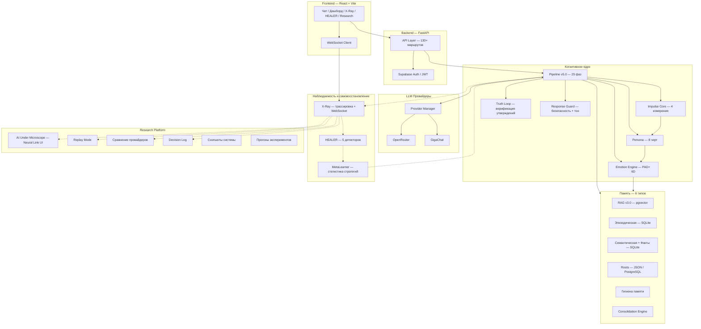
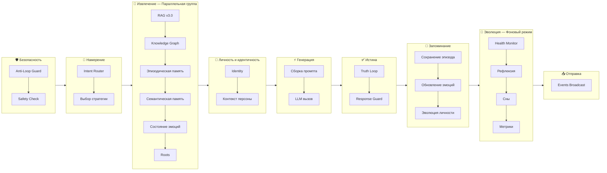
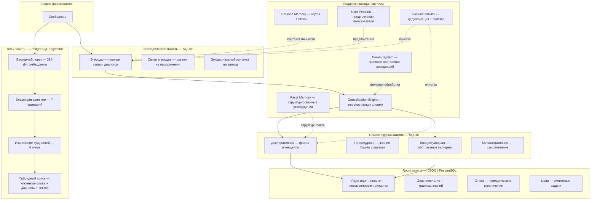

```mermaid
graph TD
    subgraph Repo ["Репозиторий PAD+ AI"]
        BE[backend/ — FastAPI]
        FE[frontend/ — React + Vite]
        HL[HEALER/ — Модуль самовосстановления]
        DOC[docs/ — Документация]
        TST[tests/ — 400+ тестов]
        SCR[scripts/ — Утилиты]
        EXP[experiments/ — Прогоны исследований]
        MON[monitoring/ — Grafana + Prometheus]
        PUB[publications/ — Статьи]
    end

    BE --> API[api/ — 18 маршрутизаторов]
    BE --> CORE[core/ — Pipeline, X-Ray, Impulse]
    BE --> MEM[memory/ — 6 типов памяти]
    BE --> EMO[emotion/ — PAD+ модель]
    BE --> RT[runtime/ — Provider Manager]
    BE --> HEAL[healing/ — Интеграция HEALER]
    BE --> KNOW[knowledge/ — Граф знаний]
    BE --> EXP_BE[experiments/ — Исследования]

    FE --> PAGES[pages/ — 15 страниц]
    FE --> COMP[components/ — UI компоненты]

    HL --> DIAG[healer/diagnostics/ — 9 модулей]
    HL --> PATCH[healer/patcher/ — 7 паттернов]
    HL --> VER[healer/verifier/ — 4 модуля]

    DOC --> ARCH[docs/architecture/]
    DOC --> IMP[docs/impulse/]
    DOC --> ADR[docs/adr/]

    TST --> PIPE[tests/test_pipeline/]
    TST --> XR[tests/test_xray/]
    TST --> HARD[tests/hardening/]
```

# PAD+ AI Technology Overview

**Версия:** 4.1  
**Дата:** Июль 2026  
**Статус:** Technical Whitepaper — v1.0  
**Лицензия:** Apache 2.0  

---

## Executive Summary

PAD+ AI — исследовательская реализация когнитивной архитектуры для языковых моделей. Система работает как промежуточный слой между пользователем и LLM, пропуская каждый запрос через последовательность когнитивных фаз перед генерацией ответа.

Система решает конкретную инженерную проблему: традиционный паттерн запрос→LLM→ответ не имеет механизмов для управления состоянием, интеграции памяти, верификации или наблюдаемости поведения. Вся логика сжата в один промпт, и система не имеет возможности анализировать собственную работу.

PAD+ AI реализует модульный пайплайн из 25 фаз, разделённых на синхронный (критичный для ответа) и асинхронный (аналитический) пути выполнения. Архитектура включает шесть типов памяти (эпизодическая, семантическая, RAG через векторный поиск, персона, корневая и гигиена), шестимерную эмоциональную модель, слой когнитивной предрасположенности (Impulse Core), подсистему верификации утверждений (Truth Loop) и структурную систему идентичности (Persona).

Три подсистемы поддерживают базовую архитектуру: X-Ray обеспечивает полную наблюдаемость со структурированной трассировкой и WebSocket-трансляцией в реальном времени; HEALER обеспечивает самодиагностику и настраиваемое восстановление; Research Platform предоставляет инструменты для отслеживания экспериментов, повторного воспроизведения трасс и сравнения провайдеров.

Проект не пытается заменить или конкурировать с языковыми моделями. Он исследует, какая инфраструктура вокруг LLM необходима для интерпретируемости поведения, сохранения состояния и многослойности рассуждений.

**Текущий статус:** Версия 4.1, развёрнута на Render. Более 400 тестов проходят. Базовый пайплайн стабилен, известные архитектурные ограничения задокументированы в Cognitive State Audit.

---

## 1. Problem Statement

### 1.1 Паттерн одного вызова

Доминирующий инженерный паттерн для приложений на больших языковых моделях следует этой последовательности:

```
Пользователь
    ↓
Промпт
    ↓
LLM
    ↓
Ответ
```

Этот паттерн имеет inherent ограничения:

- **Нет промежуточного состояния.** Система не имеет механизма для поддержания эмоционального, личностного или когнитивного состояния между запросами. Каждый запрос обрабатывается независимо.
- **Нет интеграции памяти.** Контекстное окно — единственный механизм удержания информации. Нет различия между недавним диалогом, изученными знаниями или неизменяемыми принципами.
- **Нет верификации.** Сгенерированный ответ принимается без структурной проверки. Нет механизма для проверки утверждений на соответствие сохранённым знаниям.
- **Нет наблюдаемости.** Внутренний процесс рассуждений непрозрачен. Если система выдаёт некорректный ответ, диагностика причины требует умозаключений на основе только выходных данных.
- **Нет поведенческой адаптации.** Система не может корректировать своё поведение на основе паттернов успеха или неудачи по множеству запросов.

### 1.2 Инженерные последствия

Эти ограничения создают конкретные инженерные проблемы:

1. **Причинная прерывистость.** Когда система не может ссылаться на собственные предыдущие шаги рассуждений, каждый ответ генерируется без осознания цепочки рассуждений, которая к нему привела.
2. **Фрагментация состояния.** Любое управление состоянием должно быть реализовано внешне, что ведёт к ad-hoc решениям, не являющимся частью процесса генерации.
3. **Диагностическая слепота.** Без структурированной наблюдаемости деградация производительности, паттерны ошибок и дрейф поведения невидимы, пока не проявятся в ответах пользователю.
4. **Статическое поведение.** Система не может адаптировать стратегию обработки на основе накопленного опыта.

### 1.3 Область применения PAD+ AI

PAD+ AI решает эти проблемы, реализуя структурированный слой обработки между пользователем и LLM. Система не модифицирует саму LLM, но контролирует, какой контекст собирается перед генерацией и какая верификация применяется после генерации.

---

## 2. Project Vision

### 2.1 Происхождение

PAD+ AI развивался органически, а не был спроектирован сверху вниз. Последовательность разработки отражает реальные инженерные ограничения, обнаруженные в процессе реализации:

1. **Базовый пайплайн (v1–v3).** Начальная реализация фокусировалась на системах памяти (эпизодическая, семантическая) и векторном поиске (RAG). Добавлены личность и эмоциональный движок в v3.

2. **X-Ray (v3–v4).** По мере роста сложности пайплайна до 20+ фаз внутреннее поведение стало непрозрачным. X-Ray был создан для обеспечения структурированной видимости каждой фазы обработки.

3. **HEALER (v4).** С появлением наблюдаемости стало возможным автоматически обнаруживать аномалии. HEALER был создан как диагностический слой, подписывающийся на события трассировки и запускающий алгоритмы обнаружения.

4. **Research Platform (v4.1).** Накопленные данные трассировки потребовали инструментов систематического анализа. Research Platform добавила отслеживание экспериментов, повторное воспроизведение и сравнение провайдеров.

Каждая подсистема появилась потому, что предыдущая версия вскрыла конкретное ограничение. Проект не начинался с полной архитектурной спецификации.

### 2.2 Ключевой вопрос

Проект исследует один инженерный вопрос:

> Что должно происходить между получением запроса и генерацией ответа, помимо одного вызова модели?

Это не философский вопрос о машинном сознании или общем интеллекте. Это инженерный вопрос об архитектуре системы: какие слои, какое состояние, какая верификация и какая наблюдаемость необходимы, чтобы сделать приложения на LLM надёжными и интерпретируемыми.

### 2.3 Принципы проектирования

Следующие принципы направляют архитектуру:

- **Модульность.** Каждая фаза пайплайна — независимый класс с определённым интерфейсом. Фазы могут быть заменены, переставлены или отключены без модификации соседних компонентов.
- **Наблюдаемость.** Каждый шаг обработки трассируется в реальном времени. Система не должна иметь непрозрачных сегментов.
- **Сохранение состояния.** Эмоциональное, личностное и когнитивное состояние сохраняется между сессиями и восстанавливается при перезапуске.
- **Верификация.** Утверждения в сгенерированных ответах проверяются на соответствие сохранённым знаниям, где это возможно.
- **Объяснимость.** Система записывает не только метрики, но и обоснование — почему выбрана конкретная стратегия, какие воспоминания извлечены, какие утверждения проверены.

---

## 3. Architecture Overview

### 3.1 Архитектура высокого уровня

Система следует клиент-серверной архитектуре с бэкендом на FastAPI и фронтендом на React, соединёнными через HTTP и WebSocket.



### 3.2 Основные подсистемы

| Подсистема | Функция | Реализация |
|-----------|----------|----------------|
| Pipeline | Оркестрация обработки запросов | PipelineExecutor v5.0, 25 фаз |
| Impulse Core | Слой когнитивной предрасположенности | 4 измерения (понять/улучшить/защитить/создать) |
| Persona | Система идентичности | 8 черт, ценности, стиль общения |
| Emotion Engine | Модель аффективного состояния | PAD+ 6 измерений |
| Memory | Многослойное хранение знаний | 6 типов на 3 бэкендах |
| Truth Loop | Верификация утверждений | Проверка утверждений после генерации |
| Provider Manager | Унифицированный LLM-интерфейс | Цепочки fallback, пользовательские ключи |
| X-Ray | Наблюдаемость | Сбор трасс + WebSocket-трансляция |
| HEALER | Самодиагностика | 5 детекторов, 3 режима работы |
| Research Platform | Инфраструктура экспериментов | Повтор трасс, сравнение провайдеров, снэпшоты |

### 3.3 Ключевые архитектурные решения

**Pipeline v5.0 — Hot/Background Split (ADR-0001):** Фазы разделены на синхронные (критичные для ответа) и асинхронные (аналитические). Синхронные фазы выполняются последовательно и блокируют ответ. Фоновые фазы выполняются как fire-and-forget через `asyncio.create_task()`. Это сократило задержку ответа примерно на 30–50%.

**Политика согласованности хранения (P2):** PostgreSQL является источником истины. JSON-файлы обеспечивают чтение-запасной вариант и пишутся параллельно (dual-write). Это обеспечивает работоспособность в средах без PostgreSQL при сохранении целостности данных в продакшне.

**Пользовательские API-ключи:** Каждый пользователь предоставляет свои собственные API-ключи LLM. Система использует ключи пользователя для генерации и эмбеддингов. Системные ключи служат только как запасной вариант. Ключи шифруются в покое с использованием Fernet.

---

## 4. Cognitive Pipeline

### 4.1 Обзор

Пайплайн — центральный механизм оркестрации. Каждый пользовательский запрос проходит через последовательность фаз, каждая из которых читает и пишет в общий объект `PipelineContext`. Пайплайн определяет два пути выполнения: синхронный (hot) и фоновый (background).

### 4.2 Структура пайплайна



### 4.3 Состав фаз

Пайплайн содержит 25 зарегистрированных фаз. Anti-Loop Guard выполняется перед основной последовательностью фаз.

**Синхронный (Hot) путь:**

| Порядок | Фаза | Функция |
|-------|-------|----------|
| — | Anti-Loop Guard | Обнаружение и блокировка повторных запросов (>3 повторений) |
| 1 | Safety | Проверка безопасности ввода, защита от инъекций |
| 2 | Intent | Классификация запроса и выбор стратегии |
| 3 | RAG | Векторный поиск по сохранённым диалогам (pgvector) |
| 4 | Knowledge Graph | Извлечение концептов и связей из графа |
| 5 | Episodic | Извлечение эпизодов из эпизодической памяти |
| 6 | Semantic | Извлечение процедурных и декларативных знаний |
| 7 | Emotion | Чтение текущего эмоционального состояния |
| 8 | Impulse | Инжекция смещения когнитивной предрасположенности |
| 9 | Persona | Сборка контекста идентичности и личности |
| 10 | Roots | Извлечение фундаментальных принципов |
| 11 | Identity | Перехват вопросов о самоидентификации |
| 12 | Generate | LLM-вызов с собранным контекстом |
| 13 | Truth Loop | Верификация утверждений после генерации |
| 14 | Evaluation | Самооценка (точность, полнота, полезность, безопасность) |
| 15 | Save Episode | Сохранение эпизода диалога |
| 16 | Extraction | Извлечение сущностей и связей для графа знаний |
| 17 | Emotion Update | Обновление эмоционального состояния на основе взаимодействия |
| 18 | Impulse Update | Применение дельт когнитивной предрасположенности |
| 19 | Events Broadcast | WebSocket-трансляция событий |
| 20 | Response Guard | Финальная фильтрация ответа (безопасность, тон, когнитивный слой) |

**Фоновый путь** (fire-and-forget через `asyncio.create_task`):

| Фаза | Функция |
|-------|----------|
| Consolidation | Консолидация памяти (эпизодическая → семантическая) |
| Procedure Success | Запись успешности процедуры |
| Persona Evolution | Эволюция черт личности |
| Health | Запись метрик здоровья |
| Reflection | Пост-анализ и мета-обучение |
| Dreams | Фоновая обработка памяти |
| Metrics | Сбор метрик пайплайна и системы |

### 4.4 Контракт фаз

Каждая фаза реализует абстрактный базовый класс `PipelinePhase`. Фазы общаются через общий словарь `PipelineContext`. Контекст — единственный механизм коммуникации между фазами, без типизированной схемы для общего словаря — это известное архитектурное ограничение, задокументированное в Cognitive State Audit.

Фоновые фазы получают подмножество значений контекста, собранное из результатов синхронных фаз.

### 4.5 Выбор стратегии

Пайплайн поддерживает множество стратегий обработки. Выбор стратегии происходит во время фазы Intent на основе классификации сообщения пользователя. Стратегии могут быть переопределены рекомендациями MetaLearner при обнаружении деградации производительности.

---

## 5. Memory Architecture

### 5.1 Многослойная архитектура

Память в PAD+ AI реализована как иерархия слоёв, различающихся по бэкенду хранения, политике удержания и уровню абстракции. Знания консолидируются вверх по иерархии.



### 5.2 Типы памяти

| Тип | Хранилище | Время жизни | Содержимое | Паттерн доступа |
|------|---------|----------|---------|----------------|
| RAG | PostgreSQL (pgvector) | Долгое | Пары диалогов с эмбеддингами, темами, сущностями | Векторное сходство + ключевые слова + давность |
| Эпизодическая | SQLite | Среднее | Эпизоды диалогов с эмоциональным контекстом | Поиск по сходству |
| Семантическая | SQLite | Долгое | Типизированные знания (декларативные, процедурные, концептуальные, метакогнитивные) | Сопоставление процедур |
| Roots | PostgreSQL / JSON | Бесконечное | Фундаментальные принципы (идентичность, эпистемология, этика, цели) | Полное чтение |
| Persona | PostgreSQL / JSON | Долгое | Черты системы (8), ценности, стиль общения | Инжекция контекста |
| User Persona | PostgreSQL / JSON | Долгое | Предпочтения пользователя (многословие, формальность, технический уровень) | Инжекция контекста |
| Факты | SQLite | Долгое | Структурированные утверждения | Подтип семантической памяти |

### 5.3 Консолидация

Consolidation Engine переносит знания вверх по иерархии памяти:

1. **Эпизодическая → Семантическая.** Паттерны из множества эпизодов извлекаются как декларативные или процедурные знания.
2. **Семантическая → Roots.** Часто подтверждаемые семантические знания повышаются до корневых принципов.

Консолидация запускается автоматически каждые N диалогов. Dream System обрабатывает память в фоновом режиме, строя ассоциации между разрозненными эпизодами.

### 5.4 Интеграция с пайплайном

Шесть фаз пайплайна напрямую взаимодействуют с памятью:

| Фаза | Операция | Тип памяти |
|-------|-----------|-------------|
| RagPhase (3) | Чтение | RAG |
| KnowledgeGraphPhase (4) | Чтение | Граф знаний |
| EpisodicPhase (5) | Чтение | Эпизодическая |
| SemanticPhase (6) | Чтение | Семантическая |
| SaveEpisodePhase (15) | Запись | Эпизодическая |
| ExtractionPhase (16) | Запись | Граф знаний |

---

## 6. Observability (X-Ray)

### 6.1 Обоснование

По мере роста пайплайна от нескольких фаз до 25 внутреннее поведение становилось всё более непрозрачным. Стандартного логирования было недостаточно для понимания, почему были приняты конкретные решения, какая фаза вызвала задержку или как менялась уверенность в процессе обработки. X-Ray был создан для обеспечения структурированной видимости каждого шага обработки в реальном времени.

### 6.2 Архитектура

X-Ray — слой наблюдаемости, встроенный в каждое выполнение пайплайна. Он состоит из следующих компонентов:

| Компонент | Функция | Реализация |
|-----------|----------|----------------|
| TraceCollector | Сбор событий | In-memory хранилище сессий, thread-safe, поддержка подписок |
| XRayTracer | Жизненный цикл span/trace | Синглтоны для создания и завершения трасс |
| TraceContext | Распределённая трассировка | Span-контекст в стиле OpenTelemetry с отношениями родитель-потомок |
| XRayTraceCollector | Управление X-Ray сессиями | Создание сессий, запись событий, завершение сессий |
| ThoughtStream | Захват мыслей в реальном времени | Пофазовые текстовые аннотации с уверенностью |
| CognitiveState | Когнитивные метрики | Отслеживание неопределённости, когнитивной нагрузки, уверенности |
| XRayBroadcaster | WebSocket-трансляция | 8 каналов (trace, thought, emotion, decision, pipeline, system, healer, all) |
| MetaLearner | Статистика стратегий | Постратегическое отслеживание успешности, обнаружение дрейфа |
| InsightsEngine | Аналитика | Обнаружение паттернов на накопленных трассах |

### 6.3 Поток данных

```
Выполнение фазы пайплайна
        │
        ▼
TraceCollector.record_event(session_id, event)
        │
        ├──► XRayBroadcaster.broadcast("trace", data)
        ├──► ThoughtStream.record(phase, text, confidence)
        └──► CognitiveState.update(metrics)
                │
                ▼
        WebSocket-клиенты получают обновления в реальном времени
                │
                ▼
        Сессия завершена → сохранена в истории (in-memory, LRU 500)
```

### 6.4 Трассируемые события

Каждая фаза пайплайна генерирует событие трассировки, содержащее:

- Имя фазы и порядок
- Длительность в миллисекундах
- Статус (success / degradation / error)
- Специфичные для компонента данные (выбранная стратегия, проверенные утверждения, дельты эмоций)
- Человеко-читаемый текст «мысли», сгенерированный ThoughtVisualizer

### 6.5 API

| Endpoint | Назначение |
|----------|---------|
| `GET /api/v1/xray/recent` | Последние 50 трасс |
| `GET /api/v1/xray/active` | Активные сессии |
| `GET /api/v1/xray/{trace_id}` | Детали конкретной трассы |
| `GET /api/v1/xray/stats` | Агрегированная статистика |
| `WS /ws/xray` | События трассировки/мыслей/пайплайна в реальном времени |
| `GET /api/v1/xray/current` | Текущая трасса с оценкой |

### 6.6 Известные ограничения

- Сохранение трасс — in-memory с LRU-вытеснением (500 записей). Постоянное хранение отсутствует в текущей версии.
- Статистика MetaLearner накапливается без механизма затухания.
- Идентичность сессии фрагментирована между 4 системами (SessionManager, Supabase Auth, X-Ray, dialog_id).

---

## 7. Self-Healing (HEALER)

### 7.1 Обоснование

Наблюдаемость (X-Ray) сделала возможным обнаружение аномалий в выполнении пайплайна. Однако обнаружение само по себе не решает проблемы. HEALER был создан для замыкания цикла: обнаружение аномалий, диагностика их причины и применение корректирующих действий.

### 7.2 Архитектура

HEALER работает как подписка на события `TraceCollector`. После завершения каждой сессии пайплайна он запускает алгоритмы обнаружения и, в зависимости от настроенного режима, может применить восстановление.

```
Сессия пайплайна завершена
        │
        ▼
HealerListener.on_event()
        │
        ▼
run_diagnostics() → 5 детекторов
        │
        ▼
DiagnosticReport[] → ReflectionLoop
        │
        ▼
RemediationEngine (если mode=suggest или auto)
        │
        ▼
HealingChangesStore (резервное копирование + поддержка отката)
        │
        ▼
WebSocket-трансляция: диагностика + рефлексия
```

### 7.3 Детекторы

| Детектор | Условие | Восстановление |
|----------|-----------|-------------|
| SlowPhasesDetector | Generate > 8000ms или другая фаза > 5000ms (3 из 5 последних) | Переключение на более быструю модель |
| ErrorPathDetector | Необработанное исключение без fallback | Включение safe mode, повтор с альтернативным провайдером |
| BrokenPhasesDetector | Обязательная фаза отсутствует или не удалась без восстановления | Перезапуск проблемной фазы |
| ProviderHealthDetector | Частота отказов провайдера > 0.3 | Деприоритизация или исключение из ротации |
| StrategyDriftDetector | Деградация производительности стратегии со временем | Рекомендация смены стратегии через MetaLearner |

### 7.4 Режимы работы

| Режим | Поведение |
|------|----------|
| `monitor` | Запуск детекторов, логирование результатов, без автоматических изменений (по умолчанию) |
| `suggest` | Запуск детекторов, генерация рекомендаций по восстановлению, без применения |
| `auto` | Запуск детекторов, применение восстановления, поддержка отката |

### 7.5 Интеграция

HEALER реализован как два компонента:

1. **Внутренний модуль** (`backend/healing/`): Детекторы, движок восстановления, хранилище изменений, цикл рефлексии. Ноль внешних зависимостей.
2. **Внешний проект** (`HEALER/`): Модули диагностики (9), паттерны патчинга (7), модули верификации (4), meta-learner. Интегрирован через `HealerBridge`.

### 7.6 Границы применения

Следующие действия разрешены в режиме `auto`:
- Смена модели (в рамках настроенных провайдеров)
- Очистка кэша
- Понижение стратегии (reasoning → simple)
- Fallback провайдера

Следующие действия ограничены режимом `suggest`:
- Отключение фазы пайплайна
- Модификация политик безопасности
- Изменение API-ключей
- Модификации кода (без AST-патчинга)

---

## 8. Research Platform

### 8.1 Обоснование

Накопление данных трассировки от X-Ray и диагностических отчётов от HEALER создало потребность в инструментах систематического анализа. Research Platform предоставляет инфраструктуру для проектирования, запуска и сравнения экспериментов на когнитивной архитектуре.

### 8.2 Компоненты

**AI Under Microscope.** Визуализация всех фаз пайплайна в реальном времени с использованием Neural Link UI. Каждая фаза отображает статус (ожидание/выполнение/завершено/ошибка), длительность выполнения, оценку и раскрывающуюся карточку «почему» с обоснованием. Данные подаются через WebSocket с автоматическим fallback на polling.

**Replay Mode.** Сохранённые трассы могут быть воспроизведены для пост-анализа. Endpoint повторного воспроизведения загружает снэпшот трассы и рендерит его через тот же визуализационный пайплайн. Снэпшоты хранятся в `experiments/snapshots/`.

**Compare Providers.** Сравнение провайдеров по трём метрикам: задержка (время генерации), стоимость (использование токенов) и качество (оценка). Поддерживает экспорт в JSON и CSV.

**Decision Log.** Фильтруемый журнал системных решений, связанный с модулем Living Anatomy. Решения помечены по модулю и компоненту, что позволяет фильтровать представление.

**System Snapshots.** Срезы состояния всех подсистем на момент времени. Снэпшоты можно просматривать со страницы анатомии или использовать для межсессионного сравнения.

### 8.3 API

| Endpoint | Назначение |
|----------|---------|
| `GET /api/v1/xray/current` | Текущая трасса с оценкой |
| `WS /api/v1/xray/ws` | Обновления трасс в реальном времени |
| `GET /api/v1/experiments/runs` | Список прогонов экспериментов |
| `POST /api/v1/experiments/replay` | Загрузка сохранённой трассы для повторного воспроизведения |
| `GET /api/v1/experiments/compare-providers` | Данные сравнения провайдеров |
| `GET /api/v1/decisions?component=<id>` | Фильтрованный журнал решений |
| `GET /api/v1/anatomy/status` | Статус модулей в реальном времени |

### 8.4 Исследовательские возможности

Платформа обеспечивает следующие типы исследований:

- **Анализ поведения.** Наблюдение за обработкой конкретного запроса пайплайном через все 25 фаз с пофазовой длительностью и обоснованием решений.
- **Регрессионное тестирование.** Сравнение поведения пайплайна между версиями кода с использованием сохранённых трасс.
- **Бенчмаркинг провайдеров.** Измерение различий в задержке, стоимости и качестве между LLM-провайдерами для идентичных запросов.
- **Исследование архитектуры.** Тестирование вариантов конфигурации пайплайна и сравнение результатов.

---

## 9. Technology Stack

### 9.1 Основные технологии

| Компонент | Технология | Версия |
|-----------|------------|---------|
| Среда выполнения бэкенда | Python | 3.11+ |
| Веб-фреймворк | FastAPI | 0.109 |
| ASGI-сервер | Uvicorn | — |
| Валидация данных | Pydantic | v2 |
| Фреймворк фронтенда | React | 18 |
| Инструмент сборки | Vite | 5 |
| CSS-фреймворк | Tailwind CSS | 3 |
| Графики | Recharts | — |
| Визуализация графов | ReactFlow | — |

### 9.2 Хранение данных

| Хранилище | Технология | Назначение |
|-------|------------|---------|
| Основная БД | PostgreSQL 15 (Supabase) | RAG, ключи пользователей, персона, импульс, эмоции, граф знаний |
| Векторный поиск | pgvector | Поиск по сходству эмбеддингов |
| Локальное хранение | SQLite | Эпизодическая память, семантическая память, граф знаний (dev) |
| Файлы состояния | JSON | Эмоции, импульс, персона (запасной вариант и разработка) |

### 9.3 LLM-интерфейс

| Компонент | Роль |
|-----------|------|
| ProviderManager | Унифицированный интерфейс для всех LLM-провайдеров |
| OpenRouter | Основной провайдер (доступ к множеству моделей) |
| GigaChat | Запасной провайдер (OAuth, бесплатный доступ) |
| ModelRouter | Выбор дешёвой vs. сильной модели |
| CognitiveBudget | Бюджетирование токенов и стоимости |

### 9.4 Инфраструктура

| Сервис | Назначение |
|---------|---------|
| Supabase | Аутентификация, PostgreSQL, Row Level Security |
| Render | Web Service (бэкенд) + Static Site (фронтенд) |
| Docker | Контейнеризированное развёртывание |
| GitHub Actions | CI (pytest, ruff, black, mypy) |

### 9.5 Архитектурные паттерны

- **Pipeline pattern.** Последовательное выполнение фаз с общим контекстом.
- **Observer pattern.** Подписка TraceCollector для интеграции X-Ray и HEALER.
- **Singleton pattern.** Emotion engine, impulse core, менеджеры памяти (известное архитектурное ограничение — глобальная область видимости там, где предпочтительна область сессии).
- **Strategy pattern.** Множественные стратегии обработки, выбираемые для каждого запроса.
- **Fallback chain.** Деградация провайдера инициирует автоматическое переключение на альтернативных провайдеров.

---

## 10. Current Project Status

### 10.1 Реализовано и стабильно

| Подсистема | Статус | Подтверждение |
|-----------|--------|----------|
| Pipeline v5.0 (25 фаз) | Стабильно | Hot/Background split работает, 380+ тестов пайплайна проходят |
| X-Ray наблюдаемость | Стабильно | Сбор трасс, WebSocket-трансляция, ThoughtVisualizer, отслеживание когнитивного состояния |
| HEALER диагностика | Стабильно | 5 детекторов, 3 режима, хранилище изменений с откатом |
| Research Platform | Стабильно | Microscope, replay, сравнение провайдеров, decision log, снэпшоты |
| RAG память | Стабильно | PostgreSQL/pgvector, классификация тем, извлечение сущностей, гибридный поиск |
| Граф знаний | Стабильно | NetworkX, извлечение концептов/связей, API endpoints, ReactFlow-визуализация |
| Emotion Engine | Стабильно | PAD+ 6-мерная модель, затухание, вычисление стиля |
| Impulse Core | Стабильно | V1 runtime, 4 измерения, инжекция в пайплайн, двойное хранение |
| Truth Loop | Стабильно | Извлечение утверждений, верификация по памяти, оценка уверенности |
| Provider Manager | Стабильно | OpenRouter + GigaChat, цепочки fallback, пользовательские ключи с шифрованием |
| Фронтенд | Стабильно | 15 страниц, hash-навигация, WebSocket-интеграция |
| CI/CD | Стабильно | GitHub Actions, автоматический деплой на Render |

### 10.2 В тестировании / Известные ограничения

Следующие архитектурные ограничения задокументированы в Cognitive State Audit (июль 2026):

| Ограничение | Влияние | Статус |
|------------|--------|--------|
| Emotion/Impulse как глобальные синглтоны | Нет изоляции сессий — состояние общее для всех пользователей | Задокументировано, Фаза C плана эволюции |
| Двойной источник истины (PersonaMemory.users vs UserPersona) | Состояние пользователя хранится в двух системах с независимыми путями обновления | Задокументировано, Фаза A плана эволюции |
| Фрагментированное обучение (4 MetaLearner) | Результаты стратегий отслеживаются независимо без координации | Задокументировано, Фаза D плана эволюции |
| Фрагментированная идентичность сессии | Сессия управляется через 4+ системы с ручным маппингом ID | Задокументировано, Фаза C плана эволюции |
| Сломанные контракты пайплайна (3 ключа читаются, но не пишутся) | Тихие no-op в оценке, рефлексии и сохранении эпизодов | Задокументировано, Фаза A плана эволюции |
| Отсутствие завершающего жизненного цикла | Открытые соединения и потоки при завершении процесса | Задокументировано |
| Orphaned фаза (MemoryMaintenancePhase) | Реализована, но никогда не зарегистрирована в пайплайне | Задокументировано |

### 10.3 Покрытие тестами

| Категория | Количество |
|----------|-------|
| Тесты фаз пайплайна | 49 |
| X-Ray тесты | 14 |
| Тесты hardening | 225 |
| Интеграционные тесты | ~10 |
| HEALER тесты (reflection loop) | 7 |
| HEALER тесты (changes store) | 7 |
| Тесты согласованности хранения | 8 |
| **Всего** | **400+** |

---

## 11. Roadmap

### 11.1 Завершённые версии

| Версия | Веха |
|---------|-----------|
| v1 | Эпизодическая + Семантическая память |
| v2 | RAG + Векторный поиск |
| v3 | Личность + Emotion Engine |
| v4 | Когнитивный пайплайн (текущий) |
| v4.1 | Research Platform: AI Under Microscope, WebSocket live X-Ray, Replay, Compare Providers, Decision Log ↔ Anatomy, Snapshot ↔ Anatomy |

### 11.2 Планируемое развитие

Следующие пункты взяты из существующей документации roadmaps (`README.md`, `docs/ARCHITECTURE_EVOLUTION_PLAN.md`, `docs/RELEASE_v4.0.md`).

**v4.2 (в разработке):**
- Поддержка multi-worker
- Асинхронная консолидация памяти
- Структурированное логирование (JSON-формат для ELK/Loki)

**v4.3 (запланировано):**
- Расширенные метрики оценки
- Экспорт бенчмарков по множеству провайдеров
- Изоляция HEALER (отдельный подмодуль)

**Post-v4.x (исследовательские направления):**
- Cognitive Observatory — визуализация когнитивных процессов
- Self Evolution — автономная адаптация поведения
- Multi-Agent — координированная multi-инстансная работа

### 11.3 Архитектурная эволюция

Architecture Evolution Plan определяет поэтапную последовательность для устранения известных ограничений:

| Фаза | Фокус | Предварительное условие |
|-------|-------|-------------|
| A | Очистка архитектуры (мёртвый код, сломанные контракты, двойной SOF) | — |
| B | Стабилизация пайплайна (типизированные контракты, согласованность bg_data) | Фаза A |
| C | Изоляция сессий (per-session состояние для эмоций, импульса) | Фаза B |
| D | Унификация обучения (единая шина обучения, консолидированные MetaLearner) | Фаза C |
| E | Слой когнитивного контекста (унифицированный снэпшот состояния) | Фаза C |
| F–I | Conversation State, Decision Engine, Learning Layer, Cognitive OS | Фазы D–E |

---

## 12. Repository Structure

```
PAD+ AI/
├── backend/                        # Python бэкенд (FastAPI)
│   ├── api/                        # 18 модулей маршрутов, 130+ endpoints
│   ├── core/                       # Ядро системы
│   │   ├── pipeline/               # PipelineExecutor v5.0 + 25 фаз
│   │   ├── xray/                   # X-Ray: трассировка, трансляция, когнитивное состояние, meta-learner
│   │   ├── guard/                  # Response Guard: безопасность, тон, когнитивный слой
│   │   ├── impulse/                # Impulse Core V1: core, manager, deltas, signals
│   │   └── control_tick.py         # Автономный фоновый цикл (60с)
│   ├── memory/                     # 7 типов памяти + консолидация + гигиена
│   ├── emotion/                    # PAD+ 6-мерная эмоциональная модель
│   ├── runtime/                    # ProviderManager, LLMService, ModelRouter
│   ├── healing/                    # Интеграция HEALER: детекторы, восстановление
│   ├── knowledge/                  # Граф знаний (NetworkX)
│   ├── integration/                # HealerBridge (PAD+ ↔ HEALER)
│   ├── experiments/                # Research Platform: прогоны, снэпшоты
│   └── main.py                     # Точка входа приложения
├── frontend/                       # React + Vite фронтенд
│   ├── src/
│   │   ├── pages/                  # 15 страниц (hash-навигация)
│   │   ├── components/             # UI компоненты
│   │   └── services/               # API клиенты
│   └── public/                     # Статические ресурсы
├── HEALER/                         # Самодостаточный модуль HEALER
│   ├── healer/                     # Диагностика, патчер, верификатор, meta
│   └── aethon/                     # X-RAY ядро (trace store)
├── docs/                           # Документация (15+ документов)
│   ├── architecture/               # Документы архитектуры подсистем
│   ├── impulse/                    # Документация Impulse Core
│   └── adr/                        # Architecture Decision Records
├── tests/                          # 400+ тестов
│   ├── test_pipeline/
│   ├── test_xray/
│   ├── test_healing/
│   └── hardening/
├── experiments/                    # Определения и отчёты экспериментов
├── scripts/                        # Вспомогательные скрипты
├── monitoring/                     # Конфиги Prometheus, Grafana, Alertmanager
└── publications/                   # Опубликованные статьи и черновики
```



---

## 13. Publications

### 13.1 Опубликованные статьи

| # | Название | Платформа | Дата | Ссылка |
|---|-------|----------|------|------|
| 1 | Building a Modular Cognitive Architecture Around Modern Language Models | dev.to | Июнь 2026 | [dev.to](https://dev.to/_a9de0f38ed294cfb7e5e/building-a-modular-cognitive-architecture-around-modern-language-models-2lc1) |
| 2 | X-Ray for AI — or How I Stopped Understanding My Own Neural Network and Built My Own APM | dev.to | Июль 2026 | [dev.to](https://dev.to/_a9de0f38ed294cfb7e5e/x-ray-for-ai-or-how-i-stopped-understanding-my-own-neural-network-and-built-my-own-apm-2l4p) |

### 13.2 Запланированные статьи

| # | Название | Статус |
|---|-------|--------|
| 3 | HEALER — When Observability Is Not Enough | Черновик |
| 4 | Research Platform — From Ad-Hoc Debugging to Systematic Experimentation | Идея |
| 5 | Memory as Ecosystem — Why Vector Search Is Not Enough | Идея |
| 6 | The Truth Loop — Verifying LLM Outputs Without a Second LLM | Идея |

### 13.3 Ресурсы

| Ресурс | URL |
|----------|-----|
| GitHub Репозиторий | [github.com/Ovladimirovich/pad-plus-ai](https://github.com/Ovladimirovich/pad-plus-ai) |
| Live Demo | [pad-plus-ai.onrender.com](https://pad-plus-ai.onrender.com) |
| Telegram Канал | [t.me/padplusai](https://t.me/padplusai) |
| Telegram Бот | [t.me/padplusai_bot](https://t.me/padplusai_bot) |

---

## 14. Conclusion

PAD+ AI — это инженерный исследовательский проект, реализующий слой когнитивной архитектуры для языковых моделей. Он решает ограничения традиционного паттерна запрос→LLM→ответ путём внедрения структурированных фаз обработки, многослойной памяти, сохранения состояния, механизмов верификации и полной наблюдаемости.

Архитектура проекта развивалась в ответ на реальные инженерные ограничения: сложность пайплайна потребовала X-Ray, обнаружение аномалий потребовало HEALER, а накопление данных потребовало Research Platform. Этот органический паттерн развития означает, что каждая подсистема существует потому, что предыдущий слой вскрыл конкретное ограничение.

**Текущие возможности:**
- 25-фазный когнитивный пайплайн с синхронными и асинхронными путями выполнения
- Шесть типов памяти с автоматической консолидацией между слоями
- Шестимерная эмоциональная модель с затуханием и изменением состояния по событиям
- Система когнитивной предрасположенности с четырьмя ортогональными измерениями
- Подсистема верификации утверждений для проверки после генерации
- Полная структурированная наблюдаемость с WebSocket-трансляцией в реальном времени
- Самодиагностика с пятью детекторами и настраиваемым авто-восстановлением
- Инфраструктура экспериментов для повторного воспроизведения трасс, сравнения провайдеров и снэпшотов системы

**Известные ограничения:**
- Изоляция сессий неполная — состояние эмоций и импульса являются глобальными синглтонами
- Управление памятью не имеет автоматической очистки для накопленных данных трассировки
- Контракты фаз пайплайна основаны на соглашении, а не на типизированных схемах
- Обучение распределено между четырьмя независимыми компонентами

Эти ограничения задокументированы и рассматриваются в Architecture Evolution Plan, который определяет поэтапную последовательность для стабилизации и расширения.

Проект лицензирован под Apache 2.0 и доступен по адресу [github.com/Ovladimirovich/pad-plus-ai](https://github.com/Ovladimirovich/pad-plus-ai).

---

## Проверка по чек-листу

- ✓ Нет рекламных утверждений — фактические описания реализованной архитектуры
- ✓ Нет неподтверждённых возможностей — каждое утверждение ссылается на существующий код или задокументированный roadmap
- ✓ Соответствует текущему состоянию проекта (v4.1, июль 2026)
- ✓ Пригоден как приложение к заявке в Сколково
- ✓ Пригоден для публикации в PDF (самодостаточный Markdown)
- ✓ Пригоден как официальный Technical Whitepaper

---

*Документ создан на основе проектной документации: README.md, ARCHITECTURE.md, ACTUAL_STATE.md, COGNITIVE_STATE_AUDIT.md, XRAY.md, HEALER.md, SELF_HEALING_ARCHITECTURE.md, ARCHITECTURE_EVOLUTION_PLAN.md, RELEASE_v4.0.md, PROJECT_STRUCTURE.md, IMPULSE_CORE.md, IMPULSE_ARCHITECTURE.md, ADR-0001, .clinerules и связанных архитектурных документов.*

