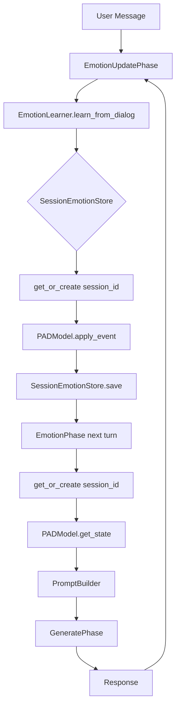
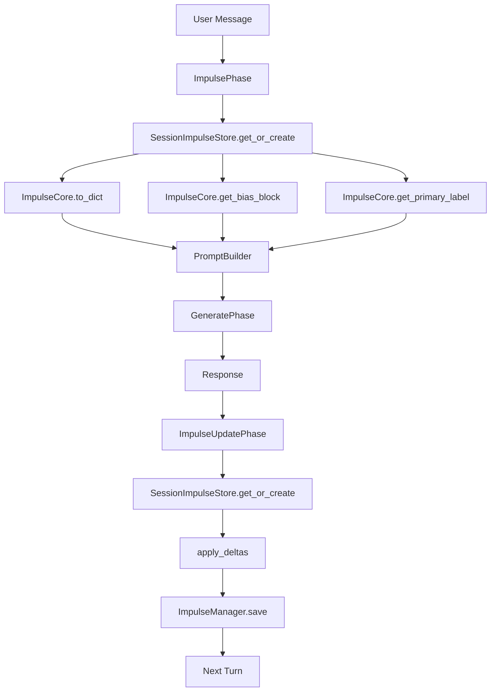
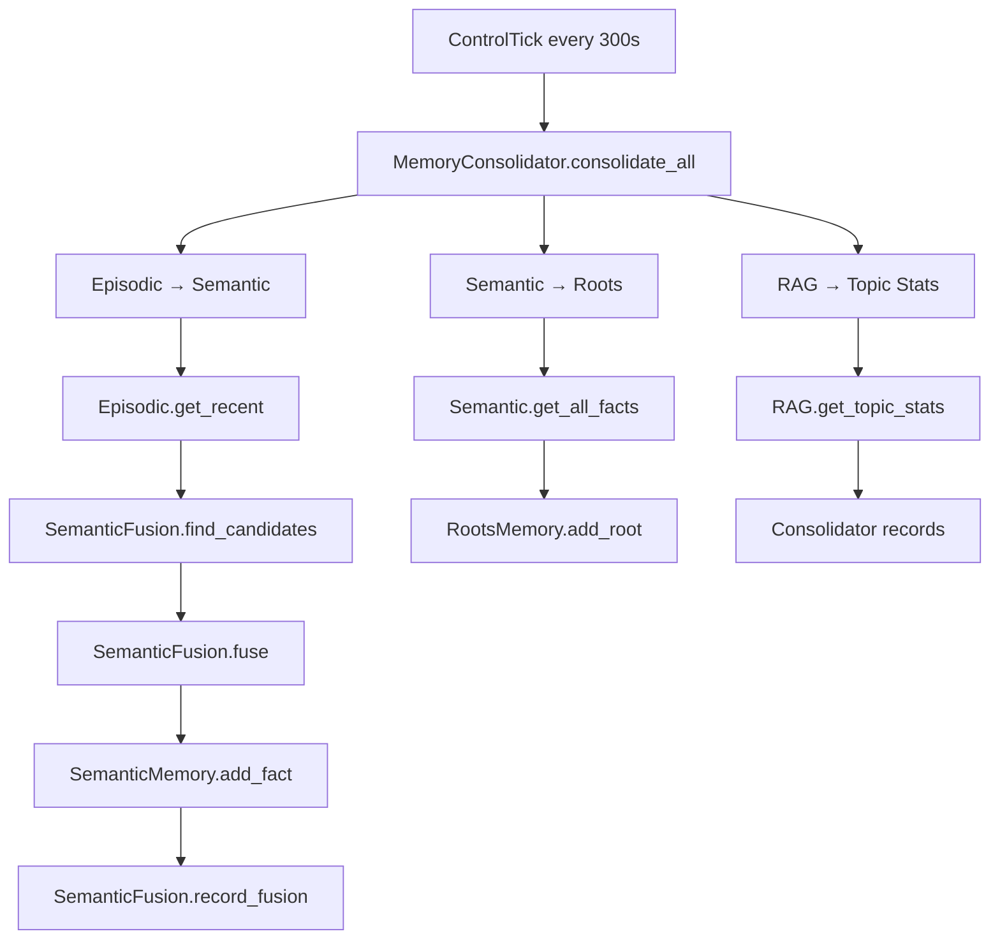

# 04_flow_mapping.md — Memory Flow Mapping

**Phase:** 1 — How memory flows  
**Status:** In Progress  
**Based on:** 01_inventory.md, 03_lifecycle.md

---

## Purpose

Показать **как информация путешествует** через систему: от пользовательского сообщения до сохранения в память и обратно.

---

## 1. Main Pipeline Memory Flow (One Turn)

```
User Message
    │
    ▼
┌─────────────────────────────────────────────────────────────┐
│                    PIPELINE TURN                            │
├─────────────────────────────────────────────────────────────┤
│                                                              │
│  SafetyPhase ──► IntentPhase ──► RAGPhase ──► KGPhase       │
│       │            │             │            │              │
│       ▼            ▼             ▼            ▼              │
│  [block?]    [intent]      [rag_context]  [graph_context]   │
│                                                              │
│  EpisodicPhase ──► SemanticPhase ──► EmotionPhase          │
│       │             │              │                         │
│       ▼             ▼              ▼                         │
│  [episodes]    [procedure]    [emotion_style]               │
│                                                              │
│  ImpulsePhase ──► PersonaPhase ──► RootsPhase              │
│       │             │              │                         │
│       ▼             ▼              ▼                         │
│  [impulse]    [persona_ctx]    [roots_ctx]                  │
│                                                              │
│  IdentityPhase ──► GeneratePhase ──► TruthLoopPhase        │
│       │             │              │                         │
│       ▼             ▼              ▼                         │
│    [is_id]      [response]     [verified]                   │
│                                                              │
│  EvaluationPhase ──► SaveEpisodePhase ──► ExtractionPhase  │
│       │             │                  │                     │
│       ▼             ▼                  ▼                     │
│    [eval]        [episode]         [concepts]               │
│                                                              │
│  EmotionUpdatePhase ──► ImpulseUpdatePhase ──► EventsPhase │
│       │                     │                     │          │
│       ▼                     ▼                     ▼          │
│    [emotion]            [impulse]              [events]     │
│                                                              │
│  PersonaEvolutionPhase ──► HealthPhase ──► ReflectionPhase │
│       │                     │                     │          │
│       ▼                     ▼                     ▼          │
│   [persona]              [health]              [reflection] │
│                                                              │
│  DreamsPhase ──► MetricsPhase ──► ResponseGuardPhase       │
│       │                     │                     │          │
│       ▼                     ▼                     ▼          │
│    [dreams]               [metrics]            [final]       │
│                                                              │
└─────────────────────────────────────────────────────────────┘
    │
    ▼
Response to User
```

---

## 2. Memory Read/Write Points per Phase

| Phase | Reads From | Writes To |
|-------|------------|-----------|
| Safety | — | `ctx.context["blocked"]`, `ctx.context["warning"]` |
| Intent | `ctx.user_message` | `intent`, `confidence`, `pipeline_meta` |
| RAG | `ctx.user_message`, `user_id` | `rag_context`, `rag_used`, `sources` |
| KnowledgeGraph | `ctx.user_message` | `graph_context`, `concepts` |
| Episodic | `user_id`, `intent` | `episodic_context`, `count` |
| Semantic | `user_message` | `procedure_context`, `procedure_name`, `procedure_id` |
| Emotion | `session_id`, `emotion_state` | `emotion_state`, `emotion_style` |
| Impulse | `session_id` | `impulse_state`, `impulse_bias`, `impulse_primary`, `impulse_active` |
| Persona | `user_id`, `intent` | `persona_context` |
| Roots | — | `roots_context` |
| Identity | `call_count`, `emotion_state`, `roots_context` | `is_identity`, `response` (if identity) |
| Generate | `user_message`, all contexts | `response`, `provider`, `confidence`, `model` |
| TruthLoop | `response`, `sources` | `truth_confidence`, `claims_verified`, `sources_info` |
| Evaluation | `response`, `context` | `evaluation`, `evaluation_skipped` |
| SaveEpisode | `response`, `intent`, `rag_used`, `procedure_name`, `truth_confidence`, `emotion_state` | `episode_id` |
| Extraction | `user_message`, `response` | `concepts_added`, `relations_added` |
| EmotionUpdate | `user_message`, `response` | `emotion_event`, `emotion_intensity` |
| ImpulseUpdate | `ctx.context`, `user_message` | `impulse_updated`, `impulse_state`, `impulse_primary` |
| EventsBroadcast | `confidence`, `rag_used`, `intent` | — (emit events) |
| PersonaEvolution | `user_id`, `user_message`, `response` | — (saves via UserPersonaManager) |
| HealthMonitor | `pipeline_success`, `rag_used` | `health_score` |
| Reflection | `pipeline_result`, `emotion_style`, `impulse_primary` | — (meta.adapt) |
| Dreams | — | — (async) |
| Metrics | — | — |
| ResponseGuard | `response`, `call_count`, `confidence` | `response` (guarded) |

---

## 3. Memory Flow by Type

### 3.1 Episodic Flow

```
User Message
    │
    ▼
SaveEpisodePhase
    │
    ├─► Episode created in EpisodicMemory
    │
    ▼
Consolidation (background, every 10 dialogs)
    │
    ├─► Episodic → Semantic (facts)
    │
    ├─► Episodic → Semantic (procedures)
    │
    ▼
Consolidation complete
    │
    ▼
SemanticMemory (facts + procedures)
    │
    ├─► RAGPhase.search() → retrieval
    │
    ├─► SemanticPhase.find_procedure()
    │
    ▼
PromptBuilder → GeneratePhase
```

### Key Points
- **Write**: SaveEpisodePhase (once per turn)
- **Read**: Consolidation (background), SemanticPhase, RAGPhase
- **Consolidation**: Episodic → Semantic (facts + procedures) → Roots

---

### 3.2 Emotion Flow

```
User Message + Response
        │
        ▼
EmotionUpdatePhase
        │
        ├─► EmotionLearner.learn_from_dialog()
        │       │
        │       ▼
        │   analysis: {event, intensity, valence}
        │       │
        │       ▼
        │   SessionEmotionStore.get_or_create(session_id)
        │       │
        │       ▼
        │   PADModel.apply_event(event, intensity)
        │       │
        │       ▼
        │   SessionEmotionStore.save(session_id)
        │
        ▼
EmotionPhase (next turn)
        │
        ├─► SessionEmotionStore.get_or_create(session_id)
        │       │
        │       ▼
        │   PADModel.get_state() → emotion_style, emotion_state
        │
        ▼
PromptBuilder → GeneratePhase
```

### Key
- **Decay**: фоновый `_decay_loop` каждую минуту
- **Persist**: EmotionUpdatePhase → `store.save(session_id)`

---

### 3.3 Impulse Flow

```
User Message
      │
      ▼
ImpulsePhase
      │
      ├─► SessionImpulseStore.get_or_create(session_id)
      │       │
      │       ▼
      │   ImpulseCore.to_dict() → impulse_state
      │   ImpulseCore.get_bias_block() → impulse_bias
      │   ImpulseCore.get_primary_label() → impulse_primary
      │
      ▼
ImpulseUpdatePhase
      │
      ├─► ensure_experience_in_context()
      │       │
      │       ▼
      │   apply_deltas() → core weights update
      │       │
      │       ▼
      │   SessionImpulseStore.save(session_id)
      │
      ▼
PromptBuilder (impulse_bias, impulse_primary)
```

### Problems
- **No session isolation**: ImpulseCore is global singleton
- **No decay**: веса не затухают
- **Stack unbounded**: push/pop без лимита

---

### 3.4 Persona Flow

```
User Message
      │
      ▼
PersonaPhase
      │
      ├─► UserPersonaManager.get_persona(user_id)
      │       │
      │       ▼
      │   UserPersona.adjust_style() based on intent
      │       │
      │       ▼
      │   UserPersonaManager.save()
      │
      ▼
PromptBuilder (persona_context)
      │
      ▼
GeneratePhase
      │
      ▼
Response
      │
      ▼
PersonaEvolutionPhase
      │
      ├─► UserPersonaManager.get_persona(user_id)
      │       │
      │       ▼
      │   UserPersona.evolve_from_dialog()
      │       │
      │       ▼
      │   UserPersonaManager.save()
```

### Problems
- **Two managers**: `PersonaMemory` (global) + `UserPersonaManager` (per-user)
- **No single owner**: дублирование логики

---

### 3.4 Consolidation Flow

```
Consolidation (background, every 10 dialogs)
      │
      ├─► Episodic → Semantic
      │       │
      │       ├─► recent = Episodic.get_recent()
      │       ├─► candidates = SemanticFusion.find_candidates()
      │       ├─► fused = SemanticFusion.fuse()
      │       ├─► SemanticMemory.add_fact()
      │       └─► SemanticFusion.record_fusion()
      │
      ├─► Semantic → Roots
      │       │
      │       ├─► Semantic.get_all_facts()
      │       └─► RootsMemory.add_root()
      │
      └─► RAG → Semantic (topic stats)
              │
              └─► RAG.get_topic_stats() → Consolidation records
```

---

## 4. Memory Flow Diagrams by Type

### 4.1 Emotion Flow (Mermaid)



---

### 4.2 Impulse Flow (Mermaid)



---

### 4.3 Consolidation Flow (Mermaid)



---

## 5. Data Flow Summary

| Flow | Source | Destination | Frequency | Latency |
|------|--------|-------------|-----------|---------|
| User → Episode | User | EpisodicMemory | Every turn | Sync |
| Episode → Semantic | EpisodicMemory | SemanticMemory | Every 10 turns | Async |
| Semantic → Roots | SemanticMemory | RootsMemory | Every 10 turns | Async |
| User → Emotion | User+Response | SessionEmotionStore | Every turn | Sync |
| Emotion → Prompt | SessionEmotionStore | PromptBuilder | Every turn | Sync |
| User → Impulse | User | SessionImpulseStore | Every turn | Sync |
| Impulse → Prompt | SessionImpulseStore | PromptBuilder | Every turn | Sync |
| Response → Consolidation | Response | Consolidation | Every 10 turns | Async |
| Semantic → Prompt | SemanticMemory | PromptBuilder | Every turn | Sync |

---

## 5. Key Bottlenecks / Risks

| Risk | Location | Impact |
|------|----------|--------|
| **Impulse global singleton** | `ImpulseCore` | No session isolation |
| **Persona dual owner** | `PersonaMemory` + `UserPersonaManager` | Inconsistent state |
| **No episode TTL** | `EpisodicMemory` | Unbounded growth |
| **No semantic deduplication** | `SemanticMemory` | Duplicate facts |
| **Context dict untyped** | `PipelineContext.context` | Runtime errors, no contracts |

---

## 6. Next: Phase 5 — Operations Catalog

*05_operations.md — каталог операций памяти (READ/WRITE/DELETE/DECAY/...)*